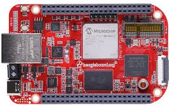
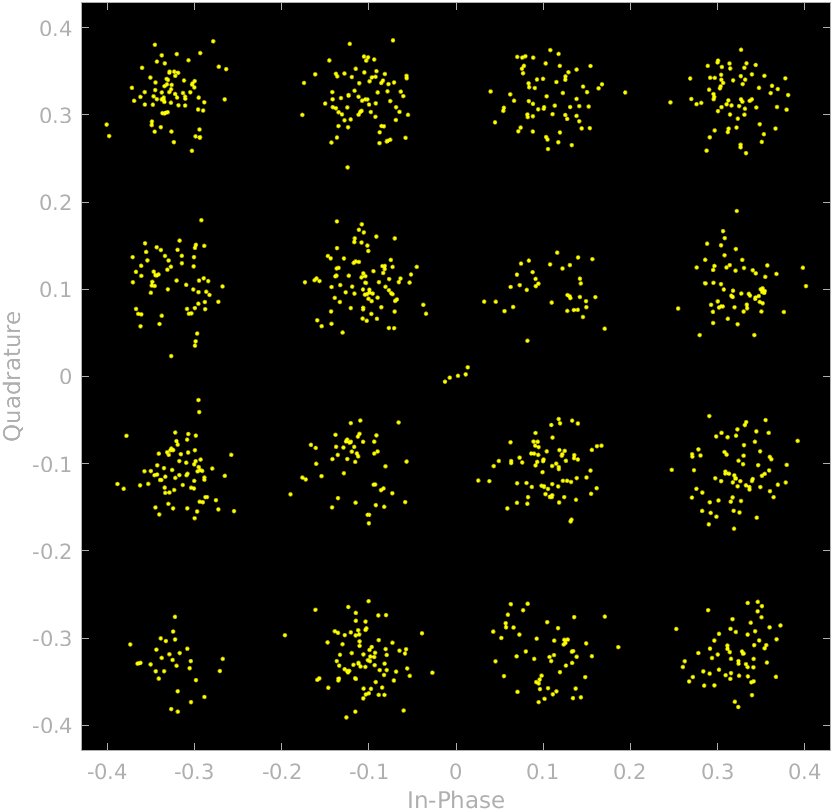
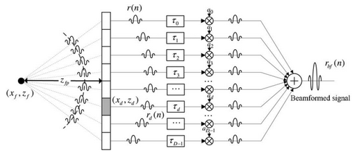
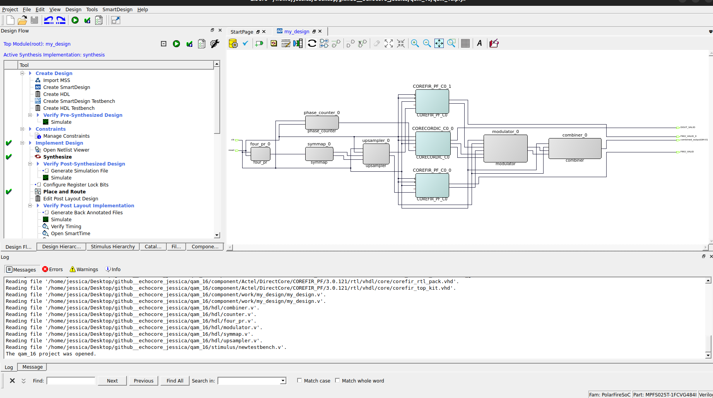
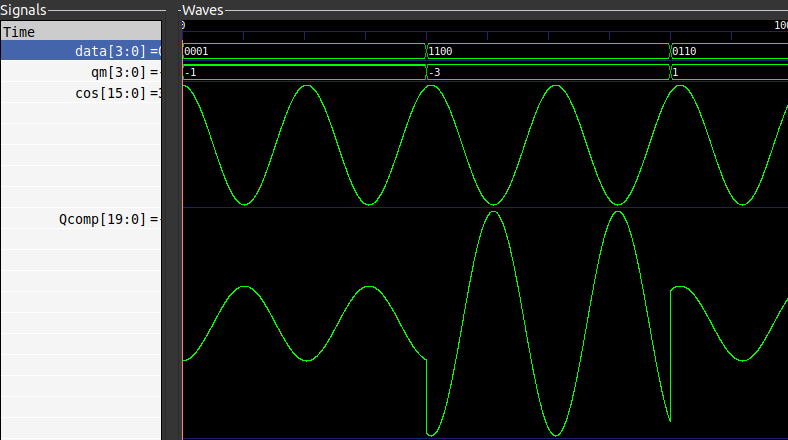
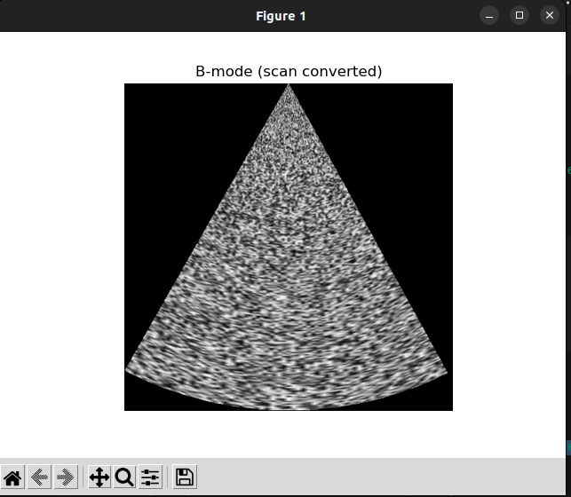

---

# EchoCore

FPGA-based parallelism for a 16-QAM wireless communication and Ultrasound POC diagnostic system.

---


## Table of Contents

  * [About the Project](#about-the-project)
      * [What is an FPGA?](#what-is-an-fpga)
      * [Why FPGA?](#why-fpga)
      * [Why 16-QAM?](#why-16-qam)
           * [More About 16-QAM](./qam16/README.md)
      * [Why Ultrasound?](#why-ultrasound)
           * [More About Ultrasound](./ultrasound/README.md) 
      * [Tech Stack](#tech-stack)
      * [File Structure](#file-structure)
  * [Getting Started](#getting-started)
      * [Prerequisites](#prerequisites)
      * [Installation](#installation)
  * [Usage](#usage)
  * [Results and Demo](#results-and-demo)
  * [Future Work](#future-work)
  * [Troubleshooting](#troubleshooting)
  * [Contributors](#contributors)
  * [Acknowledgements and Resources](#acknowledgements-and-resources)

---


## About The Project

This project demonstrates the potential of **Field-Programmable Gate Arrays (FPGAs)** by running two very different and complex workloads simultaneously on a single chip: a **16-QAM wireless communication pipeline** and a **portable Ultrasound Point-of-Care (POC) diagnostic system**.

The core innovation is the **true parallel execution** of a digital communications pipeline and a biomedical imaging pipeline. This leverages the FPGA's unique ability to perform multiple operations at the same time, unlike traditional processors that execute instructions sequentially. This approach results in a highly efficient, reconfigurable, and low-power single-chip solution for real-time signal and image processing.

---


## What is an FPGA?



A **Field-Programmable Gate Array (FPGA)** is a type of integrated circuit that can be reconfigured or reprogrammed to implement a custom digital circuit. Unlike a microprocessor that executes software instructions sequentially, the hardware logic on an FPGA is hard-wired and executes **in parallel**. This allows for extremely high performance and low latency, making FPGAs ideal for tasks requiring real-time, high-throughput data processing.

The design process for an FPGA is similar to software programming but with a hardware-centric mindset. In the context of hardware description languages (HDLs) like Verilog:

  * **Verilog Modules ≈ Functions**
  * **Top Module ≈ Main function**


---


## Why FPGA?

The FPGA's architecture is perfectly suited for a project like EchoCore for three key reasons:

1.  **Single-chip solution:** It allows for the integration of both a complex signal processing pipeline for wireless communication and an image processing pipeline for ultrasound onto a single chip, significantly reducing size, power consumption, and cost.
2.  **Re-programmable and power-efficient:** Unlike Application-Specific Integrated Circuits (ASICs), FPGAs are flexible and can be reconfigured for different applications or algorithm updates. Their hardware-based parallelism is also far more power-efficient than software-based solutions for similar tasks.
3.  **Enables parallel, real-time performance:** The most critical advantage for this project is the FPGA's ability to execute both the 16-QAM and Ultrasound pipelines in parallel, ensuring real-time performance for both data transfer and medical diagnostics.

---


## Why 16-QAM?
[For detailed information](./qam16/README.md)

**Quadrature Amplitude Modulation (QAM)** is a modulation scheme that encodes data by altering both the **amplitude and phase** of a carrier signal. 16-QAM is specifically used for this project because it is a **high data rate modulation scheme**. By representing 4 bits per symbol (2^4 = 16), it efficiently transfers large amounts of data, making it ideal for the **wireless image transfer** from the ultrasound system to a PC or tablet.

The 16-QAM signal is composed of two carrier waves that are 90 degrees out of phase, known as the **in-phase (I)** and **quadrature (Q) components**. The data stream modulates the amplitude of these waves, and the combined signal's unique amplitude and phase create a specific constellation point, which represents the digital symbol.



**Signal Flow:**

1.  **Data Input:** The incoming digital data is grouped into 4-bit chunks.
2.  **Symbol Mapping:** The 4-bit chunks are split into two 2-bit components (I and Q), which are then mapped to specific amplitude levels using Gray coding.
3.  **Upsampling:** To reduce the signal bandwidth and prevent inter-symbol interference, additional samples are inserted between each symbol.
4.  **Filtering:** A Finite Impulse Response (FIR) filter is applied to the upsampled signal to limit its bandwidth and smooth the transitions between symbols.
5.  **Carrier Mixing and Summation:** The filtered I and Q components are multiplied onto sine and cosine waves, respectively. These modulated signals are then summed to form the final transmitted QAM signal.


---


## Why Ultrasound?
[For detailed information](./ultrasound/README.md)

The Ultrasound POC (Point-of-Care) system is a key component of this project, demonstrating how FPGAs can enable portable, real-time medical diagnostics. The system is designed to be a compact and cost-effective ultrasound solution.



The ultrasound signal chain implemented on the FPGA includes:

  * **Front-End:** A 16-channel analog front-end with pulsers, multiplexers, and ADCs to achieve 32-channel performance using an **Extended Aperture (EA)** technique. This technique improves lateral resolution by using a small number of physical channels.
  * **Mid-Stage:** This stage performs essential signal conditioning, including **DC canceling**, **FIR filters**, and **time-gain compensation (TGC)**. A key innovation is the use of a **pseudo-dynamic receive beamforming** algorithm, which significantly reduces hardware complexity by updating the focusing delay value only at predetermined focal zones, as opposed to every single focusing point.
  * **Back-End:** The final stages perform **envelope detection**, **log compression** (using a look-up table), and **scan conversion** using the CORDIC algorithm to transform the polar coordinate data into Cartesian display data, enabling **real-time B-mode imaging**.


This FPGA-based design allows the entire ultrasound signal and image processing to be embedded within a single chip, making a powerful, yet portable, diagnostic system a reality.

---


## Why EchoCore Matters

EchoCore is more than just a tech demo:

* **For communications:** It shows how efficient modulation (16-QAM) can live on the same chip as other heavy tasks.
* **For healthcare:** It points toward a future where portable ultrasound devices are accessible and affordable.
* **For engineering:** It’s proof that parallel workloads (even very different ones) can share a single FPGA.

---


## Tech Stack

  * **FPGA Board:** BeagleV Fire
  * **Toolchain:** [Libero SoC v2024.2](https://ww1.microchip.com/downloads/secure/aemdocuments/documents/fpga/media-content/fpga/v2024.2/libero_socv2024.2_lin.zip)
  * **HDL:** Verilog
  * **Simulation & Visualization:** Python, MATLAB (for GUI & plots),Oscilloscope

---


## File Structure

```bash
EchoCore
├── README.md                      # Main project documentation
├── assets                         # Media
│
├── QAM16                          
│   ├── README.md                  # QAM implementation details
│   ├── workflow                   # Block diagrams and workflows
│   ├── media                      # Screenshots, test results
│   └── libero_files               # Libero project files
│
└── Ultrasound                     
    ├── README.md                  # Ultrasound implementation details
    ├── workflow                   # Signal chain and beamforming
    ├── media                      # Screenshots, test results
    ├── libero_files               # Libero project files
    └── scan_coversion             # Scan conversion python file

```

---


## Getting Started

### Prerequisites

  * Verilog coding
  * Basic knowledge of **Digital Electronics** + **Signal Processing**
  * **Libero SoC v2024.2**
  * License setup for Microchip FPGA tools

📌 Helpful learning links:

  * [ChipVerify](https://www.chipverify.com/)
  * [HDLBits](https://hdlbits.01xz.net/wiki/Main_Page)
  * [Digital Electronics Basics – Playlist 1](https://www.youtube.com/watch?v=M0mx8S05v60&list=PLBlnK6fEyqRjMH3mWf6kwqiTbT798eAOm)
  * [Digital Electronics Basics – Playlist 2](https://www.youtube.com/watch?v=BoIOLczVulQ&list=PLyqSpQzTE6M_dZdF7Bd-UncI5_L_1VkXF)
  * [Signal Processing Basics](https://youtu.be/_E-v5fl_hxc?si=1HBT6AcjhEFxtusm)
  * [CORDIC Algorithm](https://youtu.be/bre7MVlxq7o?si=WnPJowkP2e-M08Ef)

---


### Installation

1.  Download [Libero v2024.2 (Linux)](https://ww1.microchip.com/downloads/secure/aemdocuments/documents/fpga/media-content/fpga/v2024.2/libero_socv2024.2_lin.zip)
2.  Extract and install
3.  Setup license
4.  

<!-- end list -->

```sh
cd ~/Linux_Licensing_Daemon_11.19.6.0_64-bit
./lmgrd -c /path/to/License.dat
./lmutil lmstat -a -c ~/License.dat
cd ~/microchip/Libero_SoC_v2024.2/Libero/bin
export LM_LICENSE_FILE=<your_license_path>
./libero
```

---


### Usage

1.  **Clone Repository**

<!-- end list -->

```sh
git clone https://github.com/cupx0j0e/EchoCore.git
```

2.  **Open Project in Libero**
      * Launch Libero
      * Open the `.prjx` file (from `QAM16/libero_files` or `Ultrasound/libero_files`)
3.  **Explore**
4.  **Flash on your Beaglev fire fpga**

OR 

1.  **Create a new project**
2.  **Adding Custom Modules**
      * Import `.v` files → *Files → Import HDL Source Files*
      * Build hierarchy
      * Drag & drop modules into **SmartDesign**
      * Right-click inputs/outputs (e.g., `clk`, `reset`, `data_out`) → set as Top Module ports
3.  **Using IP Cores**
      * Identify and add required IP cores
      * Configure via SmartDesign pop-up
      * Save and connect ports (ensure no unconnected signals)
4.  **Simulation**
      * Import testbench `.v` file as *Stimulus*
      * Set SmartDesign as **root in hierarchy**
      * Set testbench as **Active Stimulus**
      * Run **Pre-Synthesis Simulation** (Verify → Simulate)
      * View resultant waveforms
5.  **Synthesis & Bitstream Generation**
      * Run **Synthesis** → confirm no errors
      * Open **Constraints Manager** → assign I/O pins → lock pins
      * Run **Place & Route**
      * Run **Generate Bitstream** (export under `designer/export/`)
      * Flash onto FPGA
  
 

---


## Results and Demo

The project has successfully demonstrated the individual implementation of both the 16-QAM and Ultrasound pipelines on the FPGA. The core goal of achieving full parallel execution of both pipelines is the final step.

| Feature | Status |
| :--- | :--- |
| 16-QAM TX | ✅ Completed |
| Ultrasound | ✅ Completed |
| Parallelism | 🔄 In Progress |

---

## Simulation Results:

 

The pre-synthesis simulations for both pipelines were conducted to verify the core logic before hardware implementation. The results confirmed the functionality of each module.

**16-QAM Pipeline**: The simulation **successfully** generated the I and Q components from the input 4-bit random data stream. A post-simulation analysis of the I and Q data points in MATLAB produced the expected 16-QAM constellation diagram, confirming that the symbol mapping and modulation were implemented correctly. The output waveform demonstrated the characteristic amplitude and phase shifts, validating the design.

**Ultrasound Pipeline**: The simulation of the ultrasound signal chain with synthetic echo data **confirmed the functionality** of the processing stages. The pseudo-dynamic receive beamforming algorithm successfully focused the received echoes, producing a high-amplitude peak that verified the proper application of delay values. Subsequent processing, including envelope detection and log compression, yielded data suitable for scan conversion, which, when run through the Python script, produced the expected B-mode image.

---
 
## Prototype Demonstration:

We successfully flashed the **QAM** and **ultrasound** bitstreams on Libero. For the **QAM demonstration**, the output obtained through the **UART** was connected to an **oscilloscope** to obtain the corresponding **waveforms**. For the **ultrasound** demonstration, the **UART** data was taken and run through the **scan conversion** in Python to obtain the final **B-mode image display**.


---


## Future Work

  * ✅ Implement 16-QAM on FPGA
  * ✅ Implement Ultrasound signal chain
  * 🔄 Integrate **QAM + Ultrasound** in real-time (parallel pipeline)
  * 🔄 Test with live data and optimize latency

---


## Troubleshooting

  * ❌ **Missing IP cores (Libero 2025)** → ✅ Use **Libero 2024.2**
  * ❌ **Licensing errors** → ✅ Verify license path
  * ❌ **FPGA not detected** → ✅ Check USB drivers & cable connection

---


## Contributors

  * [Jessica Jejoe](https://github.com/cupx0j0e)
  * [Ved Jain](https://github.com/vedjain773)

---


## Acknowledgements and Resources

  * [SRA VJTI – EchoCore Project](https://eklavya.sravjti.in/projects/EchoCore/)
  * [FPGA Basics Blog](https://5usu.github.io/page/USGPORT.html)
  * [IEEE Paper on QAM16](https://ieeexplore.ieee.org/document/5438705)
  * [Implementing QAM16 on FPGA](https://www.controlpaths.com/2022/12/05/implementing-qam16-on-fpga/?utm_source=chatgpt.com)
  * [Ultrasound FPGA Beamformer GitHub](https://github.com/SAFEERHYDER/FPGA_Ultrasound_DAS_Beamformer)
  * [A Single FPGA-Based Portable Ultrasound Imaging System for Point-of-Care Applications](https://drive.google.com/file/d/1WhMdFHd_UWQ18-SOCPe8W1E1RZc37owy/view?usp=sharing)


---

