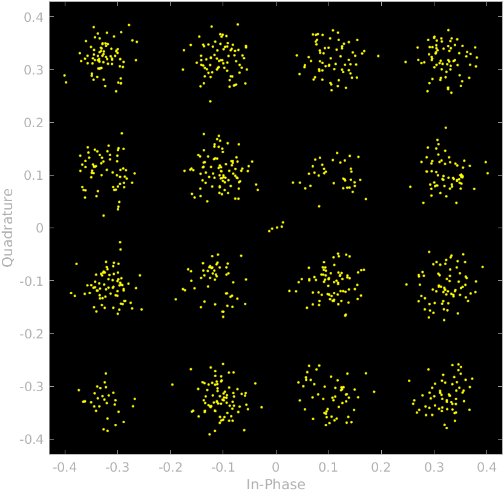
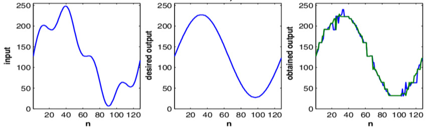
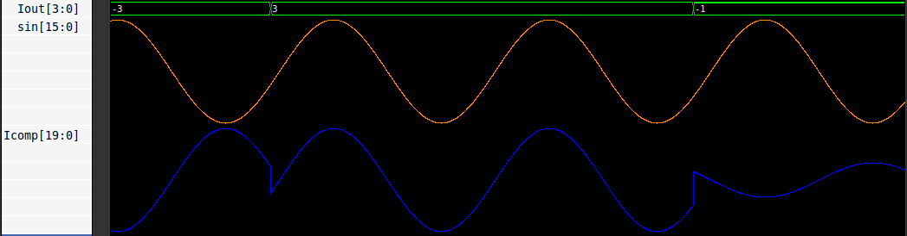
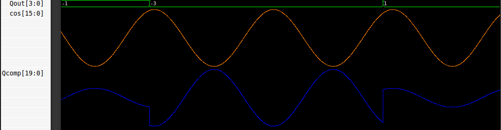
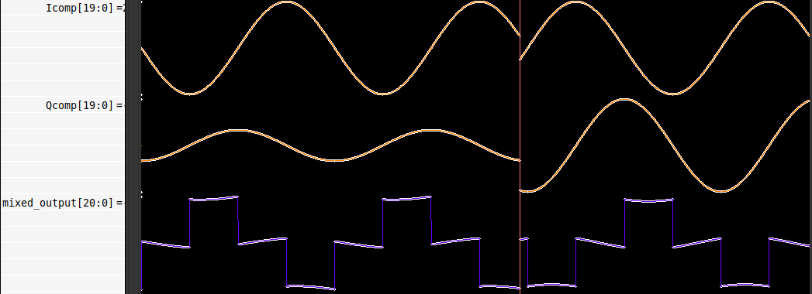

# 16-QAM Digital communication
## Table of Contents:
- [Introduction](#introduction)
    - [Brief Overview](#brief-overview)
    - [How QAM works](#how-qam-works)
- [16-QAM System Overview](#16-qam-system-overview)
    - [Flowchart](#flowchart)
    - [Data Input](#data-input)
    - [Symbol Mapping](#symbol-mapping)
    - [Upsampling](#upsampling)
    - [Filtering](#filtering)
    - [Carrier Mixing and Summation](#carrier-mixing-and-summation)
- [Resources and Further reading](#resources-and-further-reading)

## Introduction

### Brief overview
**Quadrature Amplitude Modulation (QAM)** is a modulation technique that encodes data by altering both **the amplitude and phase** of a carrier signal. This approach allows QAM to transmit more bits per symbol than modulation methods that only change one of these characteristics, such as Amplitude Shift Keying (ASK) or Phase Shift Keying (PSK).

### How QAM Works
QAM uses two carrier waves of the same frequency that are **90 degrees** out of phase with each other. These are known as the **in-phase (I)** and **quadrature (Q) components**. Each data stream modulates the amplitude of one of these carrier waves, and the two modulated signals are then combined to create the final QAM signal. This composite signal's unique amplitude and phase combination represents a specific digital symbol.

The relationship between amplitude and phase for each symbol is visualized on a **constellation diagram**. Each point on this diagram, known as a constellation point, corresponds to a unique combination of amplitude and phase, which in turn represents a specific binary value. The number of points on the constellation diagram determines the number of bits each symbol can carry, and this is what defines the "order" of QAM (e.g., 16-QAM, 64-QAM, 256-QAM). For example, 16-QAM uses 16 points, allowing it to represent 4 bits per symbol (2^4=16).

## 16-QAM System Overview

### Flowchart
Here's a simple flowchart which depicts the general signal flow during the transmission process:


### Data Input
In 16QAM, each symbol represents 4 bits.
Therefore, the incoming digital data is grouped into 4-bit chunks before modulation.

**For example:**
```
Input bitstream:  1001110010110100
Grouped (4 bits): 1001 | 1100 | 1011 | 0100
```
Each group (e.g., 1001, 1100, etc.) corresponds to one point in the 16QAM constellation.

### Symbol mapping
In this stage the incoming data is split into two components: an **I (In-phase)** component and a **Q (Quadrature)** component. The In-phase component is later modulated onto a sine wave whereas the Quadrature component is modulated onto a cosine wave.

In this implementation, the first two bits become the inphase component while the rest of the bits become the quadrature component.

**For example:**
| DATA | In-phase | Quadrature |
|------|----------|------------|
| 1100 | 11       | 00         |
| 1001 | 10       | 01         |
| 0110 | 01       | 10         |
| 0011 | 00       | 11         |

These components are further mapped using grey coding which maps a particular 4-bit data onto a unique region on the constellation map.

**For example:**
| In-phase | Symbol Map | Quadrature | Symbol Map |
|----------|------------|------------|------------|
| 00       | -3         | 00         | -3         |
| 01       | -1         | 01         | -1         |
| 11       | 3          | 11         | 3          |
| 10       | 1          | 10         | 1          |



### Upsampling
Since the signal is generated from **binary data**, the signal is discrete and the symbols of the signal are represented by deltas. The harmonic content of all of those delta signals is infinite. That means that the bandwidth needed to transmit the signal without information loss is also infinite, which is in practice impossible. 

We need to reduce the bandwidth of the signal to be able to transmit and reproduce that signal. To do that we need to make the **transition between one symbol and the next softer**. We can do that by adding a **filter**, but the filter will need some samples to perform the transition, so we also need to add some points between each symbol, in other words, we need to **upsample the signal**.

**For example:**
```
Input bitstream: 1100
Upsampled bitsream (factor=5): 1000001000000000000
```

### Filtering
After the data is upsampled, it is then passed through a FIR filter. The filter's job is to **limit the signal's bandwidth**.

In data communication, bandwidth refers to the amount of data a particular channel can transmit in a second. This is important because:
- The **spectrum** is a scarce resource. Without limiting the bandwidth of a particular channel it is possible for the signal to spread into other transmission channels used by others and interfering communication.
- If the symbols are sent without filtering, sharp transitions in the stream causes distortion and overlap in other data channels. This is called **Inter Symbol Interference**.



### Carrier mixing and Summation
In this penultimate stage, the baseband I and Q components are multiplied onto **sine and cosine** waves respectively, Their magnitudes are thus encoded **(modulated)** onto the **amplitude** of the waves.

Once the I and Q components are mixed with their respective sinusoidal waves, they are **summed** together to form the transmitted QAM signal.

This process can be understood by the expressions:

$$ Mixed(t) = Isin(2\pi f_ct) - Qcos(2\pi f_ct) $$

Here's a waveform depicting modulation of the **In-phase component** onto a sine wave


Likewise here's a waveform depicting modulation of the **Quadrature component** onto a cosine wave


And finally here's a waveform depicting the **final output** of the entire pipeline i.e. the transmitted 16QAM signal


## Resources and Further Reading
[16QAM implementation on an FPGA](https://www.controlpaths.com/2022/12/05/implementing-qam16-on-fpga/?utm_source=chatgpt.com)<br>
[IEEE paper on 16QAM](https://ieeexplore.ieee.org/document/5438705)