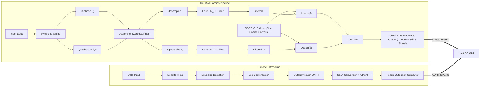
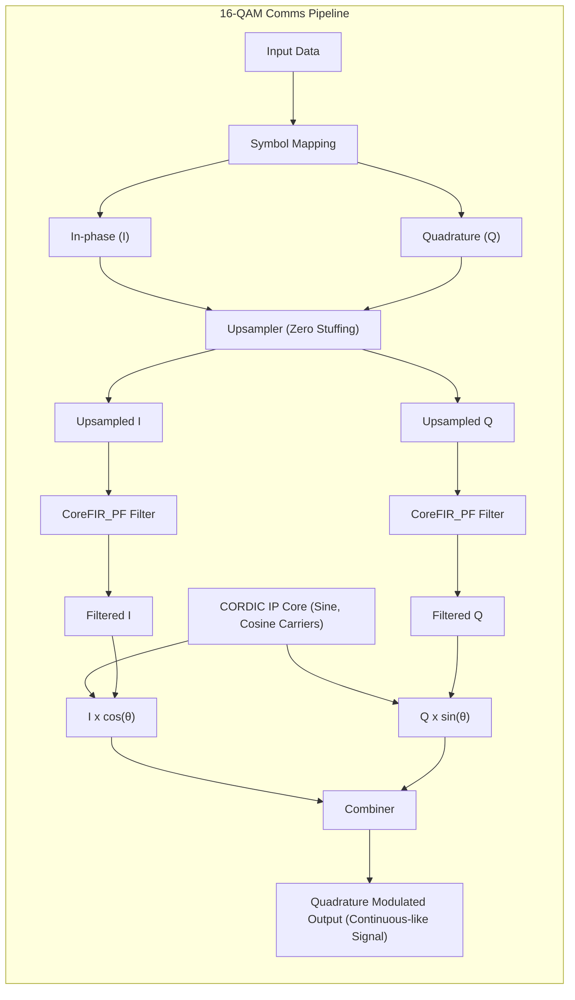
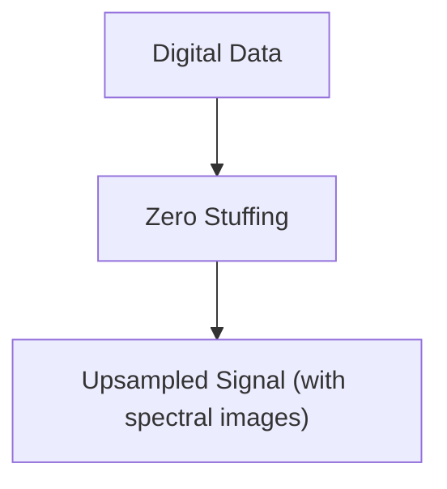
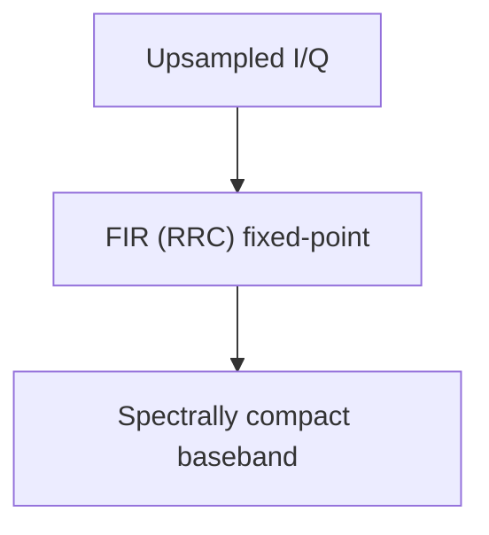
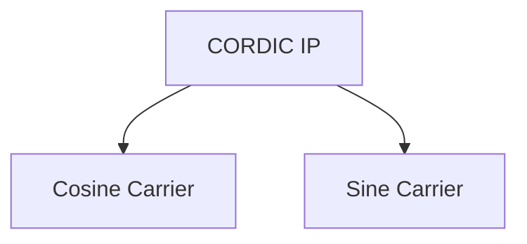
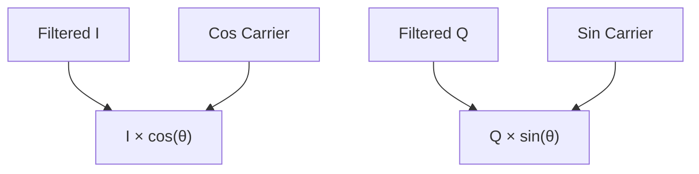
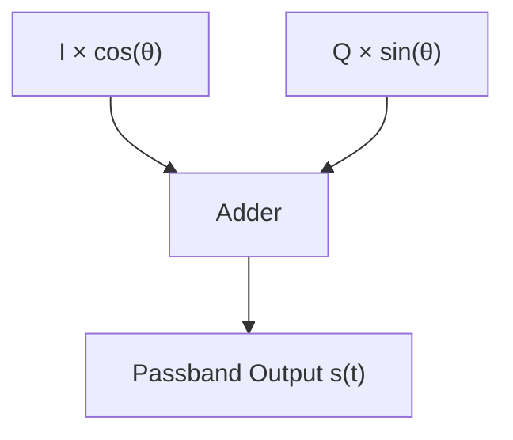

# Project Report : Echocore

## Table of Contents

* [Project Objective](#project-objective)
* [What is an FPGA and why use it?](#what-is-an-fpga-and-why-use-it)
* [System-Level Architecture](#system-level-architecture)
* [16-QAM Digital Communication](#16-qam-digital-communication)
* [Libero Design](#libero-design)

  * [Brief Overview](#brief-overview)
  * [How QAM Works](#how-qam-works)
  * [System Overview](#system-overview)
  * [Data Input](#data-input)
  * [Symbol Mapping](#symbol-mapping)
  * [Upsampling (Zero Stuffing)](#upsampling-zero-stuffing)
  * [Interpolation FIR (RRC/LPF)](#pulse-shaping--interpolation-fir-rrclpf)
  * [Carrier Generation (CORDIC)](#carrier-generation-cordic)
  * [Modulator (I/Q Mixing)](#modulator-iq-mixing)
  * [Combiner](#combiner)
---

## Project Objective

This project combines two advanced real‑world FPGA applications on a single platform: **B‑mode ultrasound imaging** and **16‑QAM digital communication**. It involves building Verilog modules for both applications and simulating/testing them using Vivado/ISE and ModelSim. Ultrasound signal processing includes **beamforming, quadrature demodulation, envelope detection, and log compression**.

For communication, a full **16‑QAM** system is developed using LUT‑based symbol mapping/demapping, a **pulse‑shaping interpolation filter**, and **CORDIC‑based carrier generation**. Data output via **UART/SPI** enables real‑time streaming of ultrasound scanlines and recovered QAM symbols to a host PC (Python/MATLAB GUI). This integrated project emphasizes **DSP techniques, FPGA toolchains, and real‑time interfacing**.

---

## What is an FPGA and why use it?

A Field‑Programmable Gate Array (FPGA) is a type of integrated circuit that can be reconfigured to implement custom digital logic. Unlike a microprocessor that executes software sequentially, FPGA hardware executes **in parallel**, enabling low latency and high throughput—ideal for real‑time signal processing.

The FPGA’s architecture is perfectly suited for Echocore for three key reasons:

1. **Single-chip solution**: It allows for the integration of both a complex signal processing pipeline for wireless communication and an image processing pipeline for ultrasound onto a single chip, significantly reducing size, power consumption, and cost.

2. **Re-programmable and power-efficient**: Unlike Application-Specific Integrated Circuits (ASICs), FPGAs are flexible and can be reconfigured for different applications or algorithm updates. Their hardware-based parallelism is also far more power-efficient than software-based solutions for similar tasks.

3. **Enables parallel, real-time performance**: The most critical advantage for this project is the FPGA's ability to execute both the 16-QAM and Ultrasound pipelines in parallel, ensuring real-time performance for both data transfer and medical diagnostics.

---

## System-Level Architecture

---

## 16-QAM Digital Communication

### Brief Overview

Quadrature Amplitude Modulation (QAM) encodes data by altering both the **amplitude** and **phase** of a carrier, allowing multiple bits per symbol (e.g., **16‑QAM → 4 bits/symbol**).

### How QAM Works

Two orthogonal carriers (90° apart) carry the **in‑phase (I)** and **quadrature (Q)** components. A constellation diagram visualizes the amplitude/phase pairs that represent binary words (Gray coded to minimize nearest‑neighbour errors).

### System Overview

#### Flowchart

The signal flow involved in the process is shown by the flowchart below

---
## Libero Design

top sd picture here

---

### 1. Data Input

Currently, the input for the entire process is prepared using a **4‑bit linear‑feedback shift register (LFSR)**. An LFSR is a shift register where the input bit at each step is a function (usually XOR) of selected prior bits. This makes LFSRs perfect for pseudorandom number generation in hardware.

The implementation of stage can be found [here](./qam16/verilog/transmission/four_pr)

---

### 2. Symbol Mapping

The process of symbol mapping involves splitting the incoming 4-bit data into two 2-bit components (which serve as the in-phase and quadrature components respectively) and then mapping the resulting vector onto a constellation map.

    <h4>Example Mapping (Gray)</h4>
    <table style='text-align: center'>
        <tr>
            <th>In‑phase</th>
            <th>Symbol Map</th>
            <th>Quadrature</th>
            <th>Symbol Map</th>
        </tr>
        <tr>
            <td>00</td>
            <td>-3</td>
            <td>00</td>
            <td>-3j</td>
        </tr>
        <tr>
            <td>01</td>
            <td>-1</td>
            <td>01</td>
            <td>-1j</td>
        </tr>
        <tr>
            <td>11</td>
            <td>3</td>
            <td>11</td>
            <td>3j</td>
        </tr>
        <tr>
            <td>10</td>
            <td>1</td>
            <td>10</td>
            <td>1j</td>
        </tr>
    </table>

**Note:** Since the quadrature components of the input data are 90deg out of phase from the inphase components, they are represented along with a 'j' in symbol mapping.

In QAM systems (like this one), symbol mapping is usually accomplished through the use of grey codes. The grey code is a binary numbering scheme where adjacent numbers differ only by a single bit. The use of gray codes resolves a major issue which lies with QAM systems: nearest-neighbour errors. Nearest-neighbour errors occur when a received point slips to a neighbouring point on the constellation map due to external noise or distorsion. Since grey codes differ only by single bits the bit error rate (BER) is reduced significantly. 

In verilog symbol mapping is achieved through the use of: 
- Bit Slicing to split the 4-bit input data to two 2-bit components 
- Case statements (multiplexers) to map the components onto a constellation map

The implementation of stage can be found [here](./qam16/verilog/transmission/symmap.v)

---

### 3. Upsampling (Zero Stuffing)

Digital data signals are inherently **discrete, random, and sharp-edged** in nature. When such signals are transmitted or processed directly, their abrupt changes in amplitude cause them to occupy a **very wide frequency spectrum**. This can create distortions, introduce unwanted spectral components, and make the signal inefficient for further processing or transmission. 
To address this, upsampling is introduced. The most common method is zero-stuffing, where zeros are inserted between the original samples to artificially increase the sampling rate. While this step by itself does not smooth the signal, it prepares the data for the next stage: filtering. 

#### How Zero Stuffing Works 
- For an upsampling factor **L**, we insert **L–1 zeros** between every original sample.
- This increases the sampling frequency but introduces spectral replicas (images) in the frequency domain.

| Input Sequence (x\[n])           | 1 | 3 | −2 | 4 | … |   |    |   |   |   |   |
| -------------------------------- | - | - | -- | - | - | - | -- | - | - | - | - |
| After Zero Stuffing (y\[n], L=3) | 1 | 0 | 0  | 3 | 0 | 0 | −2 | 0 | 0 | 4 | … |

The implementation of stage can be found [here]()

---

### 4. RRC filter
After zero stuffing, the signal contains unwanted spectral replicas. To remove these artifacts and smooth the waveform, the upsampled signal is passed through an interpolation FIR filter. 
- Implemented using CoreFIR_PF IP core in Libero SoC.
- Designed using RRC filter coefficients.
- Since FPGA hardware does not efficiently support floating-point, coefficients were scaled and quantized into fixed-point integers.
- This ensures that the filter works within hardware constraints while maintaining accuracy.

#### What is an RRC Filter ?

An **RRC filter**, or **Root-Raised-Cosine filter**, is a specialized electronic filter used in digital communication for **pulse shaping**. Its main purpose is to modify a digital signal's pulse shape to minimize **intersymbol interference (ISI)** and control the signal's bandwidth. RRC filters are crucial because they're part of a **matched filtering** scheme, which both eliminates ISI and maximizes the **signal-to-noise ratio (SNR)** at the receiver.

#### How RRC Filters Work

In a digital communication system, data is sent as a series of pulses. If these pulses are too abrupt, their spectral energy spreads over a wide frequency range. When sent over a channel with limited bandwidth, these pulses get distorted and overlap, causing ISI.

The RRC filter solves this by shaping pulses into a controlled waveform. It's designed to be used in a pair: one at the **transmitter** to shape the outgoing pulses and a second, identical filter at the **receiver** to perform matched filtering. The combined effect of these two filters is equivalent to a single **Raised-Cosine filter**. This filter's impulse response has zero crossings at every symbol period, ensuring a pulse's energy doesn't interfere with the next pulse's sampling point.  By splitting this functionality, the system achieves zero ISI and optimizes the SNR for the best possible data recovery.

#### Digital Implementation and Convolution

The RRC filter performs its function through a precise **digital convolution** process, using a **finite impulse response (FIR)** filter architecture. The input data stream is first **upsampled** by a factor of 11 by inserting 10 zero-value samples between each original data symbol. This prepares the data for shaping by increasing its sampling rate.

The upsampled data then goes into an **11-tap shift register**, which holds the most recent 11 samples. The filter's operation is a series of **multiply-and-accumulate** operations. Each of the 11 samples in the register is multiplied by its corresponding pre-calculated filter coefficient, and the products are summed to produce a single output sample.

Due to the upsampling, only one of the 11 taps in the shift register contains a non-zero value at any given time. This simplifies the convolution: at each clock cycle, only one of the 11 multiplications is a non-zero operation. As the non-zero data sample shifts its position through the register, it's sequentially multiplied by each of the filter's coefficients. This action effectively "paints" the filter's impulse response, transforming the discrete data impulses into a smooth, curved waveform. This pulse shaping is crucial for limiting the signal's bandwidth and, most importantly, for satisfying the **Nyquist ISI criterion**, ensuring the signal can be transmitted without causing intersymbol interference.

#### Mathematical Formulas

The RRC filter's behavior is defined by its frequency and impulse responses.

#### Frequency Response ($$H_{RRC}(f)$$)

The frequency response is the square root of the Raised-Cosine filter's frequency response, $$H_{RC}(f)$$:

$$
H_{RC}(f) = \begin{cases}
    T_s & \text{for } 0 \le |f| \le \frac{1-\beta}{2T_s} \\
    \frac{T_s}{2}\left[1 + \cos\left(\frac{\pi T_s}{\beta}\left[|f| - \frac{1-\beta}{2T_s}\right]\right)\right] & \text{for } \frac{1-\beta}{2T_s} < |f| \le \frac{1+\beta}{2T_s} \\
    0 & \text{for } |f| > \frac{1+\beta}{2T_s}
\end{cases}
$$
$$H_{RRC}(f) = \sqrt{H_{RC}(f)}$$

Here, $$T_s$$ is the symbol period and $$\beta$$ is the **roll-off factor**, which controls the filter's bandwidth.

#### Impulse Response ($$h_{RRC}(t)$$)

The impulse response, $$h_{RRC}(t)$$, is the inverse Fourier transform of the frequency response and is used for calculating the digital filter's coefficients.

$$h_{RRC}(t) = \frac{\cos\left(\pi(1+\beta)\frac{t}{T_s}\right) + \frac{\sin\left(\pi(1-\beta)\frac{t}{T_s}\right)}{\pi\frac{4\beta t}{T_s}}}{1-\left(\frac{4\beta t}{T_s}\right)^2}$$

Unlike the RC filter, its impulse response does **not** have zero-crossings at integer multiples of the symbol period, which is why a single RRC filter can't eliminate ISI.

#### Roll-off Factor ($\beta$)

The **roll-off factor** is a design parameter, typically from 0 to 1, that balances **spectral efficiency** and **robustness to timing jitter**.

* A **small $$\beta$$** (close to 0) results in a narrow transition band and high spectral efficiency, but the system is highly sensitive to timing errors.
* A **large $$\beta$$** (close to 1) results in a wider transition band and is more robust to timing imperfections, but it uses more bandwidth.

---

### 5. Carrier Generation (CORDIC)

**CORDIC**, which stands for **COordinate Rotation DIgital Computer**, is an efficient algorithm used to compute trigonometric functions like sine and cosine. Instead of relying on complex multipliers or large lookup tables, CORDIC uses only simple **shift-and-add** operations. This makes it a highly desirable solution for hardware implementations, such as on FPGAs, where minimizing logic area and power consumption is critical.

#### How CORDIC Works for Sine and Cosine

The core principle of CORDIC for sine and cosine generation is to iteratively **rotate a vector** in a circular coordinate system. The algorithm starts with an initial vector and rotates it through a series of small, successive steps until it reaches a target angle.

The rotation is performed using a sequence of pre-computed angles, each of which corresponds to an `arctan` of a negative power of two (e.g., 45°, 26.56°, 14.04°, etc.). Because the tangent of these angles is $2^{-i}$, the rotation can be achieved using only bit shifts and additions, which are very fast and hardware-efficient.

#### The Algorithm

To generate `sin(θ)` and `cos(θ)`, the CORDIC algorithm operates in **Rotation Mode**. We start with an initial vector $(x_0, y_0)$ and a target angle $\theta_0$. For carrier generation, we begin with a vector pointing along the x-axis, so we can set $x_0 = 1$ and $y_0 = 0$.

The algorithm then performs a series of iterations, indexed by $i = 0, 1, 2, \dots, N-1$:

$$x_{i+1} = x_i - d_i \cdot y_i \cdot 2^{-i}$$
$$y_{i+1} = y_i + d_i \cdot x_i \cdot 2^{-i}$$
$$\theta_{i+1} = \theta_i - d_i \cdot \arctan(2^{-i})$$

The variable $d_i$ is either +1 or -1. At each step, we choose the sign of $d_i$ to rotate the vector closer to the desired angle. After $N$ iterations, the final coordinates $(x_N, y_N)$ approximate the cosine and sine of the target angle, respectively.

#### Output and Scaling

The CORDIC algorithm also introduces a constant gain factor, $K$, which is a byproduct of the rotation process. The final outputs are scaled by this factor:

$$x_N \approx K \cdot \cos(\theta)$$

$$y_N \approx K \cdot \sin(\theta)$$

This gain can be compensated for either in a post-processing step or by pre-scaling the initial input vector.

#### Advantages for Carrier Generation

The use of CORDIC for carrier generation provides several key benefits:

* **Hardware Efficiency:** It eliminates the need for expensive multipliers, consuming less silicon area and power.
* **Real-time Computation:** It computes values on the fly, avoiding the memory access latency associated with large lookup tables.
* **Direct Orthogonal Output:** It simultaneously produces both sine and cosine values, which are the orthogonal carriers required for common modulation schemes like QPSK and QAM.
* **Scalable Precision:** The precision of the output can be easily increased by simply adding more iterations.

---

### 6. Modulator (I/Q Mixing)

The modulation stage maps the baseband I and Q signals onto the carriers generated by the CORDIC core.

* Common passband convention:

  $$
  s(t)1 = I(t) x cos(θ)
  $$
  $$
  s(t)2 = Q(t) x sin(θ)
  $$

  This effectively shifts the signals into the desired frequency band, producing a passband representation suitable for transmission.
  | Component | Operation | Output |
  |-----------|-----------|--------|
  | In-phase (I) | I × cos(θ) | I-component at carrier frequency |
  | Quadrature (Q) | Q × sin(θ) | Q-component at carrier frequency |

  

The implementation of stage can be found [here]()

---

### 7. Combiner

Finally, the two modulated signals are summed together to form the quadrature modulated output:

* Using the conventional sign:

$$ s(t) = I(t) × cos(θ) + Q(t) × sin(θ) $$

This combined signal contains both amplitude and phase information and represents the complete modulated waveform while producing a continuous-like, spectrally compact output.

The implementation of stage can be found [here]()

---

