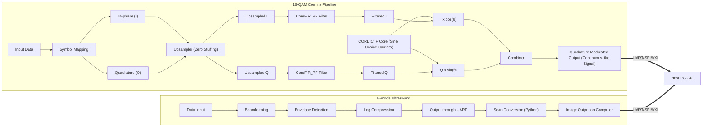
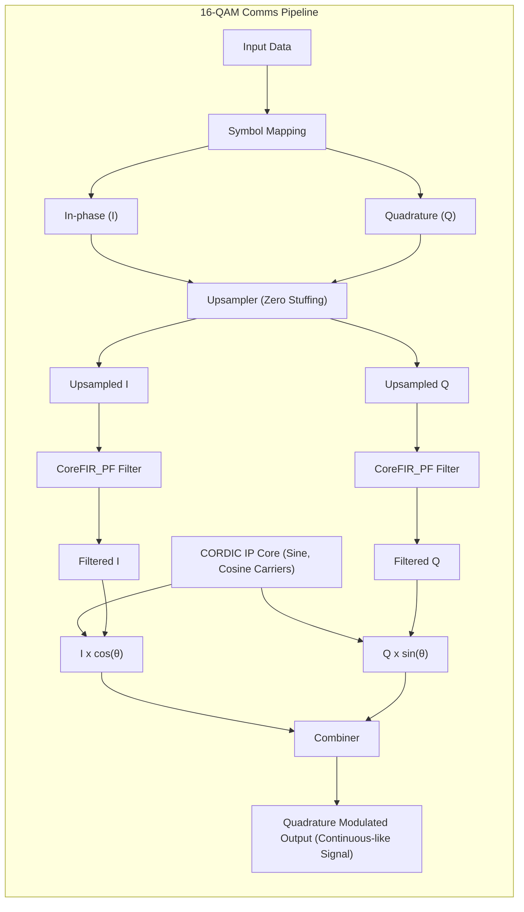
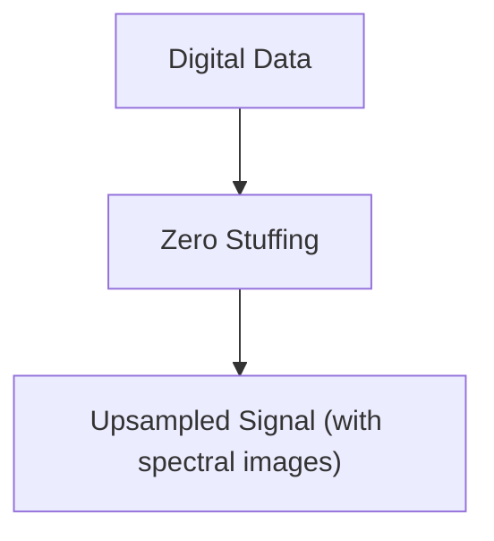
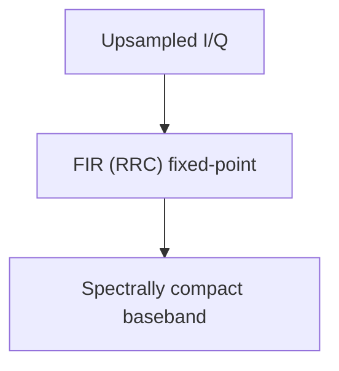
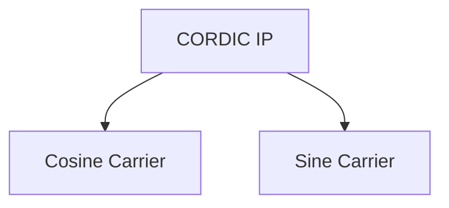
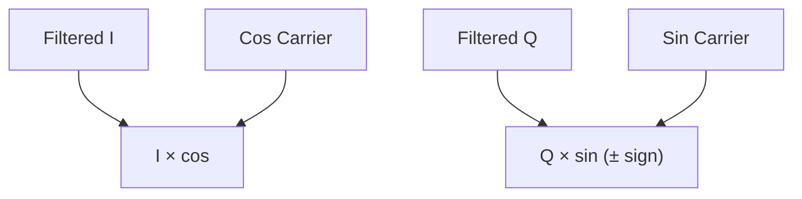
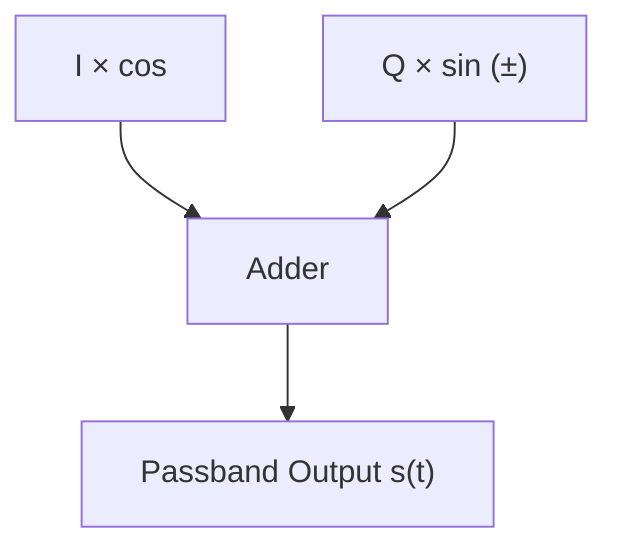

# Project Report : Echocore

## Table of Contents

* [Project Objective](#project-objective)
* [What is an FPGA and why use it?](#what-is-an-fpga-and-why-use-it)
* [System-Level Architecture](#system-level-architecture)
* [16-QAM Digital Communication](#16-qam-digital-communication)
* [Libero Design](#libero-design)

  * [Brief Overview](#brief-overview)
  * [How QAM Works](#how-qam-works)
  * [System Overview](#system-overview)
  * [Data Input](#data-input)
  * [Symbol Mapping](#symbol-mapping)
  * [Upsampling (Zero Stuffing)](#upsampling-zero-stuffing)
  * [Interpolation FIR (RRC/LPF)](#pulse-shaping--interpolation-fir-rrclpf)
  * [Carrier Generation (CORDIC)](#carrier-generation-cordic)
  * [Modulator (I/Q Mixing)](#modulator-iq-mixing)
  * [Combiner](#combiner)
---

## Project Objective

This project combines two advanced real‑world FPGA applications on a single platform: **B‑mode ultrasound imaging** and **16‑QAM digital communication**. It involves building Verilog modules for both applications and simulating/testing them using Vivado/ISE and ModelSim. Ultrasound signal processing includes **beamforming, quadrature demodulation, envelope detection, and log compression**.

For communication, a full **16‑QAM** system is developed using LUT‑based symbol mapping/demapping, a **pulse‑shaping interpolation filter**, and **CORDIC‑based carrier generation**. Data output via **UART/SPI** enables real‑time streaming of ultrasound scanlines and recovered QAM symbols to a host PC (Python/MATLAB GUI). This integrated project emphasizes **DSP techniques, FPGA toolchains, and real‑time interfacing**.

---

## What is an FPGA and why use it?

A Field‑Programmable Gate Array (FPGA) is a type of integrated circuit that can be reconfigured to implement custom digital logic. Unlike a microprocessor that executes software sequentially, FPGA hardware executes **in parallel**, enabling low latency and high throughput—ideal for real‑time signal processing.

The FPGA’s architecture is perfectly suited for Echocore for three key reasons:

1. **Single-chip solution**: It allows for the integration of both a complex signal processing pipeline for wireless communication and an image processing pipeline for ultrasound onto a single chip, significantly reducing size, power consumption, and cost.

2. **Re-programmable and power-efficient**: Unlike Application-Specific Integrated Circuits (ASICs), FPGAs are flexible and can be reconfigured for different applications or algorithm updates. Their hardware-based parallelism is also far more power-efficient than software-based solutions for similar tasks.

3. **Enables parallel, real-time performance**: The most critical advantage for this project is the FPGA's ability to execute both the 16-QAM and Ultrasound pipelines in parallel, ensuring real-time performance for both data transfer and medical diagnostics.

---

## System-Level Architecture

---

## 16-QAM Digital Communication

### Brief Overview

Quadrature Amplitude Modulation (QAM) encodes data by altering both the **amplitude** and **phase** of a carrier, allowing multiple bits per symbol (e.g., **16‑QAM → 4 bits/symbol**).

### How QAM Works

Two orthogonal carriers (90° apart) carry the **in‑phase (I)** and **quadrature (Q)** components. A constellation diagram visualizes the amplitude/phase pairs that represent binary words (Gray coded to minimize nearest‑neighbour errors).

### System Overview

#### Flowchart

The signal flow involved in the process is shown by the flowchart below

---
## Libero Design

top sd picture here

---

### 1. Data Input

Currently, the input for the entire process is prepared using a **4‑bit linear‑feedback shift register (LFSR)**. An LFSR is a shift register where the input bit at each step is a function (usually XOR) of selected prior bits. This makes LFSRs perfect for pseudorandom number generation in hardware.

The implementation of stage can be found [here](./qam16/verilog/transmission/four_pr)

---

### 2. Symbol Mapping

The process of symbol mapping involves splitting the incoming 4-bit data into two 2-bit components (which serve as the in-phase and quadrature components respectively) and then mapping the resulting vector onto a constellation map.

    <h4>Example Mapping (Gray)</h4>
    <table style='text-align: center'>
        <tr>
            <th>In‑phase</th>
            <th>Symbol Map</th>
            <th>Quadrature</th>
            <th>Symbol Map</th>
        </tr>
        <tr>
            <td>00</td>
            <td>-3</td>
            <td>00</td>
            <td>-3j</td>
        </tr>
        <tr>
            <td>01</td>
            <td>-1</td>
            <td>01</td>
            <td>-1j</td>
        </tr>
        <tr>
            <td>11</td>
            <td>3</td>
            <td>11</td>
            <td>3j</td>
        </tr>
        <tr>
            <td>10</td>
            <td>1</td>
            <td>10</td>
            <td>1j</td>
        </tr>
    </table>

**Note:** Since the quadrature components of the input data are 90deg out of phase from the inphase components, they are represented along with a 'j' in symbol mapping.

In QAM systems (like this one), symbol mapping is usually accomplished through the use of grey codes. The grey code is a binary numbering scheme where adjacent numbers differ only by a single bit. The use of gray codes resolves a major issue which lies with QAM systems: nearest-neighbour errors. Nearest-neighbour errors occur when a received point slips to a neighbouring point on the constellation map due to external noise or distorsion. Since grey codes differ only by single bits the bit error rate (BER) is reduced significantly. 

In verilog symbol mapping is achieved through the use of: 
- Bit Slicing to split the 4-bit input data to two 2-bit components 
- Case statements (multiplexers) to map the components onto a constellation map

The implementation of stage can be found [here](./qam16/verilog/transmission/symmap.v)

---

### 3. Upsampling (Zero Stuffing)

Digital data signals are inherently **discrete, random, and sharp-edged** in nature. When such signals are transmitted or processed directly, their abrupt changes in amplitude cause them to occupy a **very wide frequency spectrum**. This can create distortions, introduce unwanted spectral components, and make the signal inefficient for further processing or transmission. 
To address this, upsampling is introduced. The most common method is zero-stuffing, where zeros are inserted between the original samples to artificially increase the sampling rate. While this step by itself does not smooth the signal, it prepares the data for the next stage: filtering. 

#### How Zero Stuffing Works 
- For an upsampling factor **L**, we insert **L–1 zeros** between every original sample.
- This increases the sampling frequency but introduces spectral replicas (images) in the frequency domain.

| Input Sequence (x\[n])           | 1 | 3 | −2 | 4 | … |   |    |   |   |   |   |
| -------------------------------- | - | - | -- | - | - | - | -- | - | - | - | - |
| After Zero Stuffing (y\[n], L=3) | 1 | 0 | 0  | 3 | 0 | 0 | −2 | 0 | 0 | 4 | … |

The implementation of stage can be found [here]()

---

### 4. RRC filter
After zero stuffing, the signal contains unwanted spectral replicas. To remove these artifacts and smooth the waveform, the upsampled signal is passed through an interpolation FIR filter. 
- Implemented using CoreFIR_PF IP core in Libero SoC.
- Designed using RRC filter coefficients.
- Since FPGA hardware does not efficiently support floating-point, coefficients were scaled and quantized into fixed-point integers.
- This ensures that the filter works within hardware constraints while maintaining accuracy.

---

### 5. Carrier Generation (CORDIC)

Carrier signals are required for modulation. Instead of using large lookup tables or floating-point computations, the design uses the CORDIC IP core, which generates sine and cosine waveforms using only shift-and-add operations. 
- CORDIC Advantages:
  - Hardware-efficient (no multipliers, no floating-point).
  - Scalable and real-time computation.
  - Directly produces orthogonal sine (sin θ) and cosine (cos θ) carriers.

---

### 6. Modulator (I/Q Mixing)

The modulation stage maps the baseband I and Q signals onto the carriers generated by the CORDIC core.

* Common passband convention:

  $$
  s(t)1 = I(t) x cos(θ)
  $$
  $$
  s(t)2 = Q(t) x sin(θ)
  $$

  This effectively shifts the signals into the desired frequency band, producing a passband representation suitable for transmission.
  | Component | Operation | Output |
  |-----------|-----------|--------|
  | In-phase (I) | I × cos(θ) | I-component at carrier frequency |
  | Quadrature (Q) | Q × sin(θ) | Q-component at carrier frequency |

  

The implementation of stage can be found [here]()

---

### 7. Combiner

Finally, the two modulated signals are summed together to form the quadrature modulated output:

* Using the conventional sign:

$$ s(t) = I(t) × cos(θ) + Q(t) × sin(θ) $$

This combined signal contains both amplitude and phase information and represents the complete modulated waveform while producing a continuous-like, spectrally compact output.

The implementation of stage can be found [here]()

---

