# Project Report : Echocore

This project combines two advanced real-world FPGA applications on a single platform: B-mode ultrasound imaging and 16-QAM digital communication. It involves building Verilog modules for both applications and simulate/test them using Vivado/ISE and ModelSim. Ultrasound signal processing includes beamforming, quadrature demodulation, envelope detection, and log compression. 

For communication, a full 16-QAM system is developed using LUT-based modulators/demodulators and phase accumulators. Data output via UART/SPI will allow real-time streaming of ultrasound scans and QAM symbol recovery on a host PC using Python/MATLAB GUI. This integrated project emphasizes DSP techniques, FPGA toolchains, and real-time interfacing.

## Table of Contents:
- [System Level Architecture](#system-level-architecture)
- [What is an FPGA and why use it?](#what-is-an-fpga-and-why-use-it)
- [16-QAM Digital Communication](#16-qam-digital-communication)
    - [Brief Overview](#brief-overview)
    - [How QAM Works](#how-qam-works)
    - [System Overview](#system-overview)
- [Libero Design](#libero-design)
    - [Data Input](#1-data-input)
    - [Symbol Mapping](#symbol-mapping)
    - [Upsampling (Zero Stuffing)](#upsampling-zero-stuffing)
    - [RRC filter](#rrc-filter)
        - [What is an RRC Filter ?](#what-is-an-rrc-filter-)
        - [How RRC Filters Work](#how-rrc-filters-work)
        - [Digital Implementation and Convolution](#digital-implementation-and-convolution)
        - [Mathematical Formulas](#mathematical-formulas)
        - [Frequency Response]($$h_{rrc}(t)$$)
        - [Impulse Response]($$h_{rrc}(t)$$)
        - [Roll-off Factor](#roll-off-factor-(-β-))
    - [Carrier Generation (CORDIC)](#carrier-generation-cordic)
        - [How CORDIC Works for Sine and Cosine](#how-cordic-works-for-sine-and-cosine)
        - [The Algorithm](#the-algorithm)
        - [Output and Scaling](#output-and-scaling)
        - [Advantages for Carrier Generation](#advantages-for-carrier-generation)
    - [Modulator (I/Q Mixing)](#modulator-(i/q-mixing))
    - [Combiner](#combiner)
- [Ultrasound Imaging](#ultrasound-imaging) 
    - [Brief Overview](#brief-overview-1)
    - [Why use ultrasounds](#why-use-ultrasounds)
    - [System Overview](#system-overview-1)
        - [Flowchart](#flowchart-1)
- [Libero Design](#libero-design)
    - [Data input](#data-input)
    - [Beamforming](#beamforming)
        - [Newton-Rapheson Method](#newton-rapheson-method)
        - [Non-restoring algorithm](#non-restoring-method)
    - [Envelope Detection](#envelope-detection)
        - [Hilbert transform](#hilbert-transform)
    - [Log Compression](#log-compression)
        - [Calculation of the integral part](#calculation-of-the-integral-part)
        - [Calculation of the fractional part using CORDIC](#calculation-of-the-fractional-part)
    - [Scan Conversion](#scan-conversion)
    - [References and Acknowledgements](#references-and-acknowledgments)
- [TLDR;](#tldr)

## System Level Architecture
---

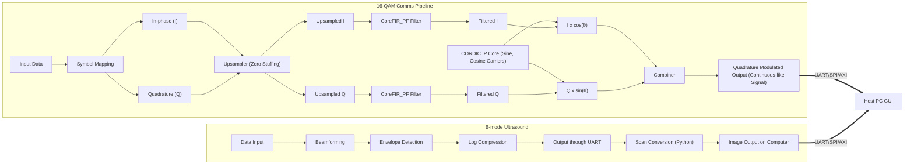

---
### 16-QAM Digital Communication

This part of the project focuses on transmitting data by altering the amplitude and phase of a carrier signal using Quadrature Amplitude Modulation (QAM). Key steps include:

**Data Input:** Pseudorandom data is generated using a 4-bit linear-feedback shift register (LFSR).

**Symbol Mapping:** The 4-bit data is split into in-phase (I) and quadrature (Q) components and mapped to specific points on a constellation diagram. Gray codes are used during this mapping to minimize bit errors caused by noise.

**Modulation:** The I and Q components are used to modulate two carrier waves that are 90 degrees out of phase, creating a composite signal that represents a unique symbol.

### Ultrasound Imaging

The ultrasound pipeline processes signals to create a 2D grayscale image from ultrasonic echoes. The process involves:

**Data Input:** Ultrasound transducers convert returning echoes into digital values, which are read from a file.

**Beamforming:** This crucial step aligns signals received at different times by multiple transducer channels. It applies calculated delays so the signals can be summed up coherently. The project switched from the resource-intensive Newton-Raphson method to the more hardware-efficient Non-Restoring algorithm for calculating square roots to determine these delays.

**Envelope Detection:** The high-frequency oscillations are removed from the beamformed signal to reveal the "shape" or amplitude profile. This is done by creating an analytic signal using the Hilbert Transform and then calculating its magnitude.

**Log Compression:** The wide range of signal amplitudes is compressed using a logarithmic scale to create a clearer image. The calculation for the fractional part of the logarithm is performed using the efficient CORDIC algorithm, which relies on simple shifts and additions.

**Scan Conversion:** The final step transforms the raw polar coordinate data (from the transducer) into a Cartesian (x,y) grid for display, ensuring the image is smooth and correctly proportioned for a standard screen.

## What is an FPGA and why use it?
A Field-Programmable Gate Array (FPGA) is a type of integrated circuit that can be reconfigured or reprogrammed to implement a custom digital circuit. Unlike a microprocessor that executes software instructions sequentially, the hardware logic on an FPGA is hard-wired and executes in parallel. This allows for extremely high performance and low latency, making FPGAs ideal for tasks requiring real-time, high-throughput data processing.

The FPGA's architecture is perfectly suited for a project like EchoCore for three key reasons:

1. **Single-chip solution**: It allows for the integration of both a complex signal processing pipeline for wireless communication and an image processing pipeline for ultrasound onto a single chip, significantly reducing size, power consumption, and cost.

2. **Re-programmable and power-efficient**: Unlike Application-Specific Integrated Circuits (ASICs), FPGAs are flexible and can be reconfigured for different applications or algorithm updates. Their hardware-based parallelism is also far more power-efficient than software-based solutions for similar tasks.

3. **Enables parallel, real-time performance**: The most critical advantage for this project is the FPGA's ability to execute both the 16-QAM and Ultrasound pipelines in parallel, ensuring real-time performance for both data transfer and medical diagnostics.

## 16-QAM Digital Communication

### Brief Overview

Quadrature Amplitude Modulation (QAM) encodes data by altering both the **amplitude** and **phase** of a carrier, allowing multiple bits per symbol (e.g., **16‑QAM → 4 bits/symbol**).

### How QAM Works

Two orthogonal carriers (90° apart) carry the **in‑phase (I)** and **quadrature (Q)** components. A constellation diagram visualizes the amplitude/phase pairs that represent binary words (Gray coded to minimize nearest‑neighbour errors).

### System Overview

#### Flowchart

The signal flow involved in the process is shown by the flowchart below

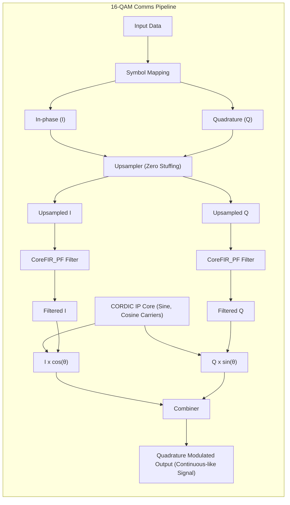

## Libero Design

 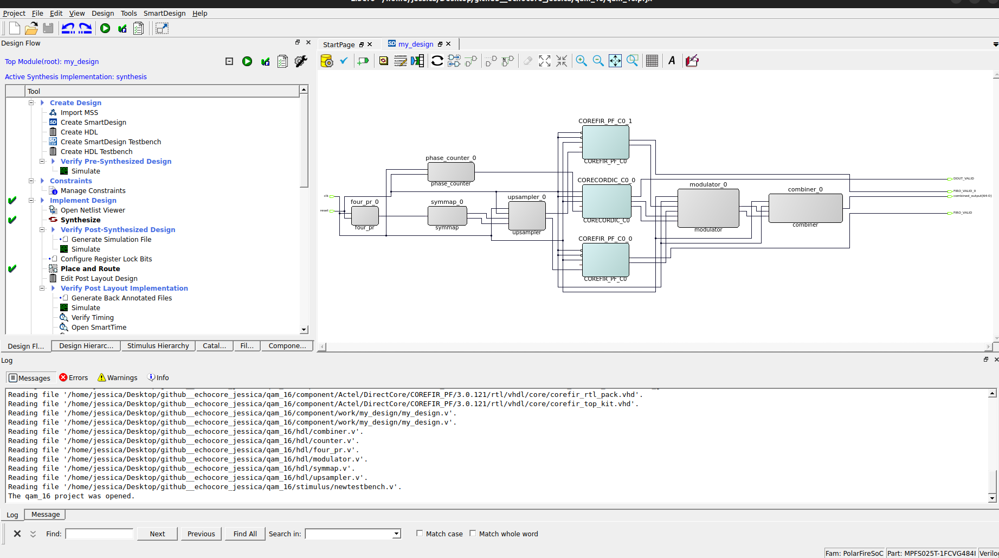

### 1. Data Input

Currently, the input for the entire process is prepared using a **4‑bit linear‑feedback shift register (LFSR)**. An LFSR is a shift register where the input bit at each step is a function (usually XOR) of selected prior bits. This makes LFSRs perfect for pseudorandom number generation in hardware.

The implementation of stage can be found [here](./qam_16/libero/hdl/four_pr.v)

### 2. Symbol Mapping

The process of symbol mapping involves splitting the incoming 4-bit data into two 2-bit components (which serve as the in-phase and quadrature components respectively) and then mapping the resulting vector onto a constellation map.

    <h4>Example Mapping (Gray)</h4>
    <table style='text-align: center'>
        <tr>
            <th>In‑phase</th>
            <th>Symbol Map</th>
            <th>Quadrature</th>
            <th>Symbol Map</th>
        </tr>
        <tr>
            <td>00</td>
            <td>-3</td>
            <td>00</td>
            <td>-3j</td>
        </tr>
        <tr>
            <td>01</td>
            <td>-1</td>
            <td>01</td>
            <td>-1j</td>
        </tr>
        <tr>
            <td>11</td>
            <td>3</td>
            <td>11</td>
            <td>3j</td>
        </tr>
        <tr>
            <td>10</td>
            <td>1</td>
            <td>10</td>
            <td>1j</td>
        </tr>
    </table>

**Note:** Since the quadrature components of the input data are 90deg out of phase from the inphase components, they are represented along with a 'j' in symbol mapping.

In QAM systems (like this one), symbol mapping is usually accomplished through the use of grey codes. The grey code is a binary numbering scheme where adjacent numbers differ only by a single bit. The use of gray codes resolves a major issue which lies with QAM systems: nearest-neighbour errors. Nearest-neighbour errors occur when a received point slips to a neighbouring point on the constellation map due to external noise or distorsion. Since grey codes differ only by single bits the bit error rate (BER) is reduced significantly. 

In verilog symbol mapping is achieved through the use of: 
- Bit Slicing to split the 4-bit input data to two 2-bit components 
- Case statements (multiplexers) to map the components onto a constellation map

The implementation of stage can be found [here](./qam_16/libero/hdl/symmap.v)

### 3. Upsampling (Zero Stuffing)

Digital data signals are inherently **discrete, random, and sharp-edged** in nature. When such signals are transmitted or processed directly, their abrupt changes in amplitude cause them to occupy a **very wide frequency spectrum**. This can create distortions, introduce unwanted spectral components, and make the signal inefficient for further processing or transmission. 
To address this, upsampling is introduced. The most common method is zero-stuffing, where zeros are inserted between the original samples to artificially increase the sampling rate. While this step by itself does not smooth the signal, it prepares the data for the next stage: filtering. 

#### How Zero Stuffing Works 
- For an upsampling factor **L**, we insert **L–1 zeros** between every original sample.
- This increases the sampling frequency but introduces spectral replicas (images) in the frequency domain.

| Input Sequence (x\[n])           | 1 | 3 | −2 | 4 | … |   |    |   |   |   |   |
| -------------------------------- | - | - | -- | - | - | - | -- | - | - | - | - |
| After Zero Stuffing (y\[n], L=3) | 1 | 0 | 0  | 3 | 0 | 0 | −2 | 0 | 0 | 4 | … |

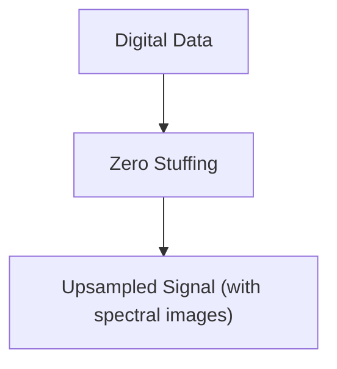

The implementation of stage can be found [here](./qam_16/libero/hdl/upsampler.v)

### 4. RRC filter
After zero stuffing, the signal contains unwanted spectral replicas. To remove these artifacts and smooth the waveform, the upsampled signal is passed through an interpolation FIR filter. 
- Implemented using CoreFIR_PF IP core in Libero SoC.
- Designed using RRC filter coefficients.
- Since FPGA hardware does not efficiently support floating-point, coefficients were scaled and quantized into fixed-point integers.
- This ensures that the filter works within hardware constraints while maintaining accuracy.

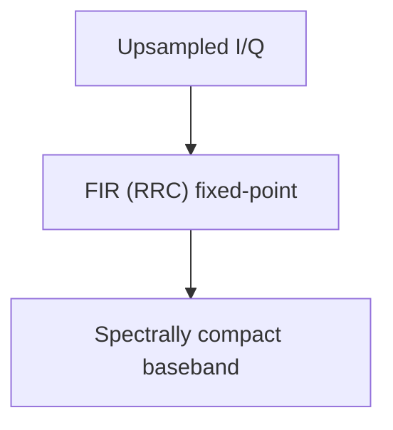

#### What is an RRC Filter ?

An **RRC filter**, or **Root-Raised-Cosine filter**, is a specialized electronic filter used in digital communication for **pulse shaping**. Its main purpose is to modify a digital signal's pulse shape to minimize **intersymbol interference (ISI)** and control the signal's bandwidth. RRC filters are crucial because they're part of a **matched filtering** scheme, which both eliminates ISI and maximizes the **signal-to-noise ratio (SNR)** at the receiver.

#### How RRC Filters Work

In a digital communication system, data is sent as a series of pulses. If these pulses are too abrupt, their spectral energy spreads over a wide frequency range. When sent over a channel with limited bandwidth, these pulses get distorted and overlap, causing ISI.

The RRC filter solves this by shaping pulses into a controlled waveform. It's designed to be used in a pair: one at the **transmitter** to shape the outgoing pulses and a second, identical filter at the **receiver** to perform matched filtering. The combined effect of these two filters is equivalent to a single **Raised-Cosine filter**. This filter's impulse response has zero crossings at every symbol period, ensuring a pulse's energy doesn't interfere with the next pulse's sampling point.  By splitting this functionality, the system achieves zero ISI and optimizes the SNR for the best possible data recovery.

#### Digital Implementation and Convolution

The RRC filter performs its function through a precise **digital convolution** process, using a **finite impulse response (FIR)** filter architecture. The input data stream is first **upsampled** by a factor of 11 by inserting 10 zero-value samples between each original data symbol. This prepares the data for shaping by increasing its sampling rate.

The upsampled data then goes into an **11-tap shift register**, which holds the most recent 11 samples. The filter's operation is a series of **multiply-and-accumulate** operations. Each of the 11 samples in the register is multiplied by its corresponding pre-calculated filter coefficient, and the products are summed to produce a single output sample.

Due to the upsampling, only one of the 11 taps in the shift register contains a non-zero value at any given time. This simplifies the convolution: at each clock cycle, only one of the 11 multiplications is a non-zero operation. As the non-zero data sample shifts its position through the register, it's sequentially multiplied by each of the filter's coefficients. This action effectively "paints" the filter's impulse response, transforming the discrete data impulses into a smooth, curved waveform. This pulse shaping is crucial for limiting the signal's bandwidth and, most importantly, for satisfying the **Nyquist ISI criterion**, ensuring the signal can be transmitted without causing intersymbol interference.

#### Mathematical Formulas

The RRC filter's behavior is defined by its frequency and impulse responses.

#### Frequency Response ($$H_{RRC}(f)$$)

The frequency response is the square root of the Raised-Cosine filter's frequency response, $$H_{RC}(f)$$:

$$
H_{RC}(f) = \begin{cases}
    T_s & \text{for } 0 \le |f| \le \frac{1-\beta}{2T_s} \\
    \frac{T_s}{2}\left[1 + \cos\left(\frac{\pi T_s}{\beta}\left[|f| - \frac{1-\beta}{2T_s}\right]\right)\right] & \text{for } \frac{1-\beta}{2T_s} < |f| \le \frac{1+\beta}{2T_s} \\
    0 & \text{for } |f| > \frac{1+\beta}{2T_s}
\end{cases}
$$
$$H_{RRC}(f) = \sqrt{H_{RC}(f)}$$

Here, $$T_s$$ is the symbol period and $$\beta$$ is the **roll-off factor**, which controls the filter's bandwidth.

#### Impulse Response ($$h_{RRC}(t)$$)

The impulse response, $$h_{RRC}(t)$$, is the inverse Fourier transform of the frequency response and is used for calculating the digital filter's coefficients.

$$h_{RRC}(t) = \frac{\cos\left(\pi(1+\beta)\frac{t}{T_s}\right) + \frac{\sin\left(\pi(1-\beta)\frac{t}{T_s}\right)}{\pi\frac{4\beta t}{T_s}}}{1-\left(\frac{4\beta t}{T_s}\right)^2}$$

Unlike the RC filter, its impulse response does **not** have zero-crossings at integer multiples of the symbol period, which is why a single RRC filter can't eliminate ISI.

#### Roll-off Factor ($\beta$)

The **roll-off factor** is a design parameter, typically from 0 to 1, that balances **spectral efficiency** and **robustness to timing jitter**.

* A **small $$\beta$$** (close to 0) results in a narrow transition band and high spectral efficiency, but the system is highly sensitive to timing errors.
* A **large $$\beta$$** (close to 1) results in a wider transition band and is more robust to timing imperfections, but it uses more bandwidth.

### 5. Carrier Generation (CORDIC)

**CORDIC**, which stands for **COordinate Rotation DIgital Computer**, is an efficient algorithm used to compute trigonometric functions like sine and cosine. Instead of relying on complex multipliers or large lookup tables, CORDIC uses only simple **shift-and-add** operations. This makes it a highly desirable solution for hardware implementations, such as on FPGAs, where minimizing logic area and power consumption is critical.

#### How CORDIC Works for Sine and Cosine

The core principle of CORDIC for sine and cosine generation is to iteratively **rotate a vector** in a circular coordinate system. The algorithm starts with an initial vector and rotates it through a series of small, successive steps until it reaches a target angle.

The rotation is performed using a sequence of pre-computed angles, each of which corresponds to an `arctan` of a negative power of two (e.g., 45°, 26.56°, 14.04°, etc.). Because the tangent of these angles is $2^{-i}$, the rotation can be achieved using only bit shifts and additions, which are very fast and hardware-efficient.

#### The Algorithm

To generate `sin(θ)` and `cos(θ)`, the CORDIC algorithm operates in **Rotation Mode**. We start with an initial vector $(x_0, y_0)$ and a target angle $\theta_0$. For carrier generation, we begin with a vector pointing along the x-axis, so we can set $x_0 = 1$ and $y_0 = 0$.

The algorithm then performs a series of iterations, indexed by $i = 0, 1, 2, \dots, N-1$:

$$x_{i+1} = x_i - d_i \cdot y_i \cdot 2^{-i}$$
$$y_{i+1} = y_i + d_i \cdot x_i \cdot 2^{-i}$$
$$\theta_{i+1} = \theta_i - d_i \cdot \arctan(2^{-i})$$

The variable $d_i$ is either +1 or -1. At each step, we choose the sign of $d_i$ to rotate the vector closer to the desired angle. After $N$ iterations, the final coordinates $(x_N, y_N)$ approximate the cosine and sine of the target angle, respectively.

#### Output and Scaling

The CORDIC algorithm also introduces a constant gain factor, $K$, which is a byproduct of the rotation process. The final outputs are scaled by this factor:

$$x_N \approx K \cdot \cos(\theta)$$

$$y_N \approx K \cdot \sin(\theta)$$

This gain can be compensated for either in a post-processing step or by pre-scaling the initial input vector.

#### Advantages for Carrier Generation

The use of CORDIC for carrier generation provides several key benefits:

* **Hardware Efficiency:** It eliminates the need for expensive multipliers, consuming less silicon area and power.
* **Real-time Computation:** It computes values on the fly, avoiding the memory access latency associated with large lookup tables.
* **Direct Orthogonal Output:** It simultaneously produces both sine and cosine values, which are the orthogonal carriers required for common modulation schemes like QPSK and QAM.
* **Scalable Precision:** The precision of the output can be easily increased by simply adding more iterations.

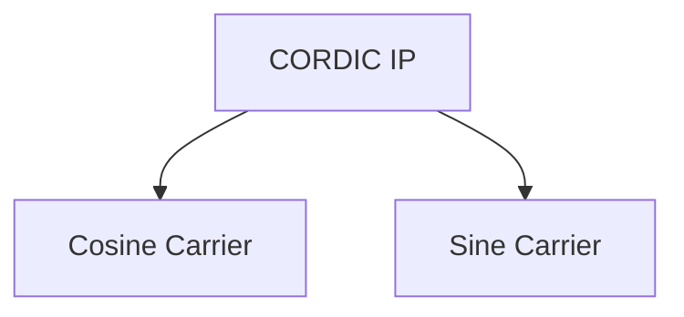

### 6. Modulator (I/Q Mixing)

The modulation stage maps the baseband I and Q signals onto the carriers generated by the CORDIC core.

* Common passband convention:

  $$
  s(t)1 = I(t) x cos(θ)
  $$
  $$
  s(t)2 = Q(t) x sin(θ)
  $$

  This effectively shifts the signals into the desired frequency band, producing a passband representation suitable for transmission.
  | Component | Operation | Output |
  |-----------|-----------|--------|
  | In-phase (I) | I × cos(θ) | I-component at carrier frequency |
  | Quadrature (Q) | Q × sin(θ) | Q-component at carrier frequency |

  
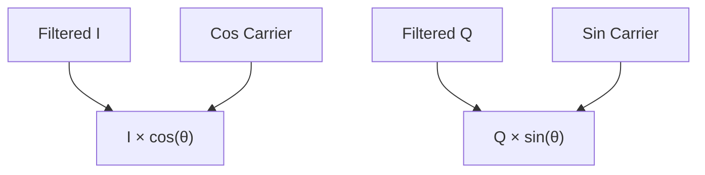

The implementation of stage can be found [here](./qam_16/libero/hdl/modulator.v)

### 7. Combiner

Finally, the two modulated signals are summed together to form the quadrature modulated output:

* Using the conventional sign:

$$ s(t) = I(t) × cos(θ) + Q(t) × sin(θ) $$

This combined signal contains both amplitude and phase information and represents the complete modulated waveform while producing a continuous-like, spectrally compact output.

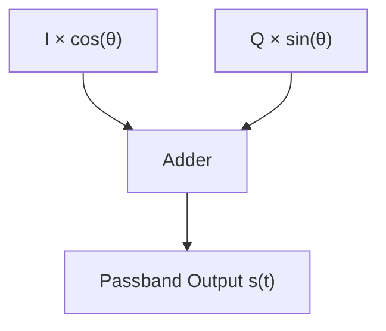

The implementation of stage can be found [here](./qam_16/libero/hdl/combiner.v)

---

## Ultrasound Imaging
### Brief Overview
B-mode ultrasonography or brightness mode ultrasonography is a common imaging technique which involves the use of ultrasonic waves to display a 2-D grayscale image of internal organs.It works by the visualizing the strength of returning ultrasonic echoes (from internal organs) and mapping them to areas of differing brightness on a screen.

Brighter areas represent stronger echoes, often indicating dense tissues, while darker areas represent weaker echoes, often indicating fluid or soft tissues.

### Why use ultrasounds?
Here are some of the reasons for using ultrasounds over imaging and scanning techniques like X-rays, CT-scans and MRIs:
- **Safety:** Ultrasound imaging makes use of ultrasound waves rather than ionizing radiation (like in X-rays and CT scans) which makes it much safer to use frequently.
- **Portability and Accessibility:** Unlike MRIs and CT-scans (which require large-fixed machines), ultrasounds can be small and portable which makes them perfect for use in a project like Echocore.
- **Cost-effectiveness:** Ultrasounds are much cheaper compared to MRIs and CT-scans which lowers maintenance and infrastructure requirements.

### System Overview
#### Flowchart
The signal flow involved in the process of ultrasound process on an FPGA is as follows:

## Libero Design

 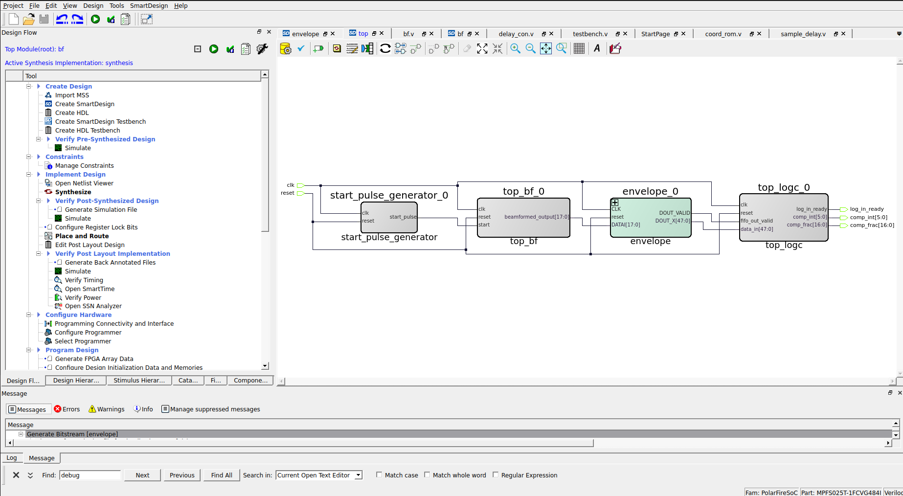
 
### Data Input
Ultrasound imaging systems typically use devices called transducers, which convert ultrasound waves into electrical signals. These transducers are usually arranged in an array, forming multiple channels. 
When ultrasound signals are reflected from tissues and return to the transducers, they are converted into digital values, typically represented in hexadecimal form. These values are stored in a file and can be read using Verilog's `readmemh` function. 

This is implemented using the module [here](./ultrasound/libero/hdl/readrf_vals.v)

### Beamforming
As ultrasound waves bounce off tissues within the body, the returning echoes arrive at the multiple transducer channels at slightly different times depending on the distance they travelled. In beamforming, carefully calculated delays are applied to the channels that receive their signals earlier, aligning them in time with the signals arriving later, so that all the echoes can be combined and processed as if they had been received simultaneously.

These delays can be calculated ahead of time as they only rely on the position of a particular transducer channel relative to other transducer channels. These delays are calculated using the formula:

$$ \text{t}=\sqrt{z^2 + (x_j-x)^2} $$

The positions of all transducer channels are also stored in hex files and are read using the module [here](./ultrasound/libero/hdl/coord_rom.v)

These values are then fed into delay calculation modules, which determine the required delay values using a square root module [here](./ultrasound/libero/hdl/sqrt_nr.v)

The Square root calculation is one of the more important parts of the entire pipeline since it is particularly difficult to implement in verilog; the choice of algorithm for the calculation of the square root thus becomes very important for the pipeline.

#### Newton-Rapheson method
The earlier iterations of the pipeline made use of the **Newton-Rapheson method** for calculating square roots.
The idea is to start with an initial guess at a root, approximate the function by its tangent line near the guess, and then take the root of the linear approximation as a next guess at the function's root. This will typically be closer to the function's root than the previous guess, and the method can be iterated. 

This can be easily understood by the formula:

$$ y_{next} = \frac{1}{2}\left( y_{curr} + \frac{N}{y_{curr}} \right) $$

where: $N$ = input number 
$y_{curr}$ = the current guess for sqrt(N) 
$y_{next}$ = the updated guess

This method remains popular among mathematicians today, as it provides an elegant algorithm for calculating square roots. However, it is not the most ideal choice for digital systems such as FPGAs, since it relies on division — an operation that is resource- and power-intensive in hardware. Additionally, the use of division introduces the risk of division by zero, meaning that any module implementing this algorithm must also include a safeguard against zero inputs.

#### Non-Restoring method
The recent iterations of the project switched to the non-restoring square root algorithm which is specifically designed for digital systems like FPGAs in mind. The algorithm works similar to long division but instead of dividing, it "builds" the square root bit by bit.

This is done by performing bit shifts and subtractions instead of using the division operator making the process a lot more efficient and quick when compared to the Newton-Rapheson method.

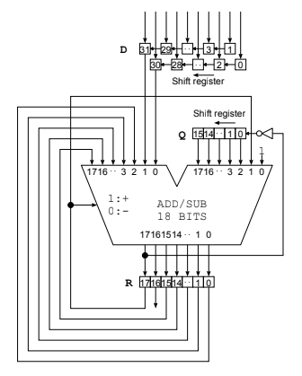

#### A comparison between the algorithms
The figure below compares different algorithms for calculating the square root of the decimal value 10,000. The Newton–Raphson method produces the correct result in 570 ps (57 cycles), while the Non-Restoring method achieves the result much faster, in 180 ps (18 cycles).

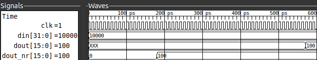

In the [delay control module](./ultrasound/libero/hdl/delay_con.v), multiple delay calculation modules are instantiated using generate blocks (one for each channel). After the delays are computed, these values are passed to the [sample delay module](./ultrasound/libero/hdl/sample_delay.v), which are also instantiated using generate blocks (again, one for each channel).

The sample delay module works like a FIFO delay line: it writes incoming samples into a buffer and reads them back after a programmable number of clock cycles, creating a flexible, per-channel time alignment unit.

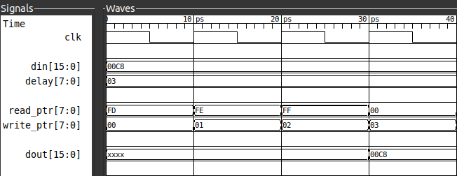

Finally the [summation module](./ultrasound/libero/hdl/summ_sa.v) makes use of a serial accumulator to sum-up all the signals from the channels after the delay has been applied.

The figure below highlights the entire pipeline at play:

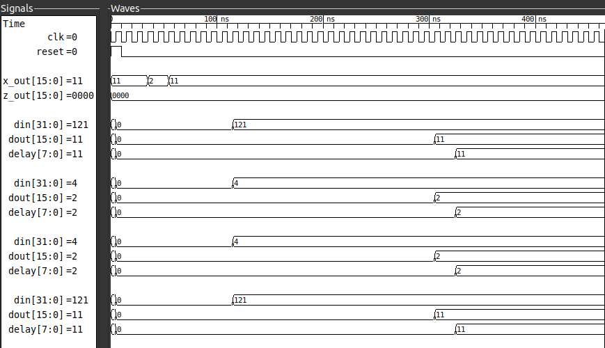
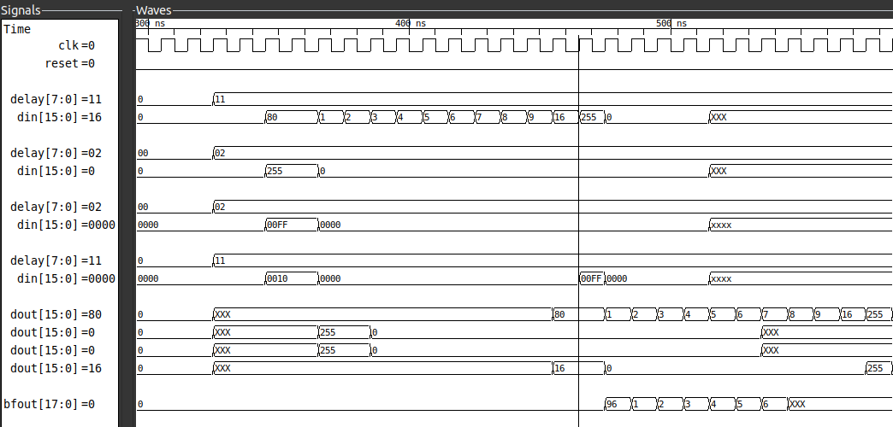

### Envelope Detection
When ultrasound waves are received by the transducer, the signals they produce are not smooth or directly interpretable; instead, they contain rapid oscillations at the carrier frequency.

Envelope detection is the process that extracts the outer “shape” or amplitude profile of these oscillating signals. By removing the high-frequency fluctuations and highlighting only the slowly varying amplitude information, envelope detection provides a clearer picture of the signal’s true strength over time. This step is crucial, because it transforms the raw radio-frequency data into a form that corresponds more closely to the variations in tissue structure, making the information suitable for further image processing and eventual visualization.

The signals formed after beamforming are oscillatory and not directly usable for image intensity. To overcome this, a quadrature component of the original signal is constructed which is then combined with the original signal to compute the magnitude. This results in a smooth envelope which corresponds to the actual echo strength from tissues.

The generation of the quadrature component is done by using a technique known as the Hilbert transform.

#### Hilbert Transform
The Hilbert Transform is a mathematical function which is used to shift the phase of a signal by 90deg. The Hilbert transform takes in a real valued function $x\left( t \right)$ and outputs a function which is phase shifted by 90deg, $\hat{x}\left( t \right)$.

Together they form the analytic signal:

$$ z\left( t \right) = x\left( t \right) + j\hat{x}\left( t \right) $$

The envelope is calculated by simply taking the magnitude of the signal:

$$ Envelope(t) = |z\left( t \right)| = \sqrt{x\left( t \right)^2 + \hat{x}\left( t \right)^2} $$

This project uses the Hilbert Transform IP core provided by Microchip to generate the quadrature component of the signal. An additional IP core ensures that the quadrature component is fully computed before both the in-phase and quadrature signals are passed to another IP core, which calculates the magnitude of the analytic signal.

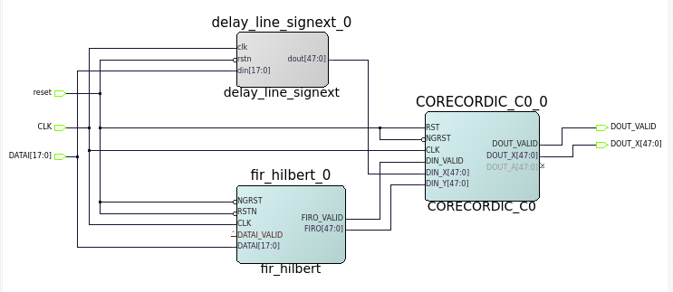

### Log Compression
The ultrasound signals still contain a wide range of amplitudes after they've been beamformed and their envelopes detected. Some echoes like the ones coming from bones are really strong, while others like the ones coming from softer tissues deeper in the body.

To address this issue, log compression is applied to the ultrasound signals. This process takes the logarithm of the envelope-detected signal reducing the dynamic range of the ultrasound signals.

The process of Log compression begins with a FIFO buffer which is responsible for storing the incoming values from envelope detection until the pipeline ahead is done processing the current input.

#### Calculation of the integral part
The Log (base 2) calculation in verilog is accomplished using two modules, one responsible for calculating the integer part of the logarithm while the other responsible for the calculation of the fractional part in fixed point format.

The process to find the integer part of the logarithm is quite straight forward, it can be easily accomplished by finding the index of the most significant bit of the number. That is,

$$ \left\lfloor \log_{2}x \right\rfloor = n \Leftrightarrow 2^n < x < 2^{n+1} $$

The implementation of this can be found [here](./ultrasound/libero/hdl/int_calc.v)

#### Calculation of the fractional part

The calculation for the fractional part of the logarithm is however a different story; the world beyond the decimal has always posed a problem for digital systems for it introduces the dilemma of range and accuracy; it is impossible to gain one without losing the other. The most recent iterations of the pipeline have used a 16-bit fractional width for the log calculation. The accuracy provided by this is also good enough for ultrasound applications.

Before computing the fractional part of the logarithm, the input is normalized by right-shifting it so that its MSB aligns with the fixed-point input range of the CORDIC unit. The fractional part is then calculated using the CORDIC algorithm.

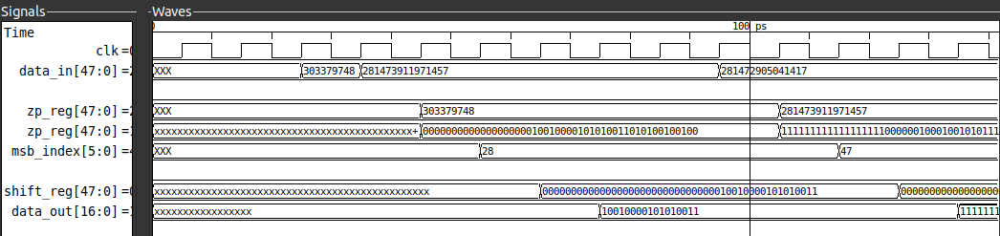

This method is highly efficient for hardware because it replaces complex multiplication and division with simple shifts and additions. The core of the algorithm is a series of conditional operations that converge to the correct fractional value over several clock cycles.

The implementation of this can be found [here](./ultrasound/libero/hdl/log_frac_calc.v)

#### The Core Idea
The algorithm leverages the following identity

$$ \log_2x = \log_2\left( \prod_{i=0}^{N-1} k_i \right) = \sum_{i=0}^{N-1}\log_2\left( k_i \right) $$

The basic idea of the process is as follows:
The algorithm behaves like a weighing scale, the goal is to maipulate one 'side' such that the tip of the scale converges towards a value.

In mathematical terms, the algorithm aims to solve the equation:

$$ y = \log_2(x) $$

This is hard to calculate directly, the equation is thus rearranged in the following manner:

$$ y - \log_2(x) = 0 $$

The goal now becomes to manipulate z in such a way that it approaches 1. This is done by leveraging the [identity](#the-core-idea) here.

Z is now multiplied with several 'special' factors which are also added on the other side of the equation to keep it balanced.

$$ y - \log(x\cdot F_1\cdot F_2\cdots) = \log(F_1) + \log(F_2) + \cdots $$

Now, if these 'special' factors are chosen cleverly such that the product:

$$ z\cdot F_1\cdot F_2\cdots F_n \to 1 $$

then: 

$$ y = \log(F_1) + \log(F_2) + \cdots + \log(F_n) $$

These 'special' factors are constants of the form:

$$1 \pm 2^{-i} $$

At each step of the iteration the value of x is compared with 1. 
- If x is greater than 1, it is multiplied by $(1-2^{-i})$
- If x is less than 1, it is multiplied by $(1+2^{-i})$

In both cases the value of y is updated by adding and subtracting precomputed values such that the original equation remains balanced.

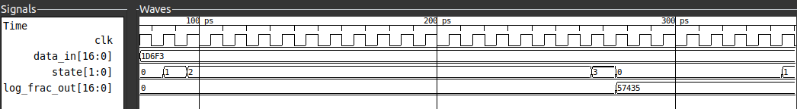

### Scan Conversion
In ultrasound imaging, data is naturally acquired in a **polar or sector format** because the transducer elements send and receive waves at different angles relative to the probe. This raw data does not directly match the rectangular grid used by standard image displays. As a result, even if the underlying signals contain useful information, the image would appear distorted or unintuitive if shown directly.

Scan conversion is the process of transforming this polar coordinate data into a **Cartesian (x, y)** grid suitable for display. It involves **interpolation**, where signal values that fall between display pixels are estimated, ensuring that the image appears smooth and continuous. By remapping the ultrasound echoes into a consistent spatial layout, scan conversion makes anatomical structures easier to interpret while **preserving spatial resolution** and minimizing distortion

If the raw beamformed data is represented in polar form as:

$$ \text{I}(r, \theta) $$

with r as depth and θ as the steering angle, scan conversion maps it to a Cartesian grid:

$$ \text{I}(x, y) = I\left(\sqrt{x^2 + y^2}, \text{ } arctan(\frac{y}{x}) \right) $$

## References and Acknowledgments
- [FPGA ultrasound imaging based system](https://drive.google.com/file/d/1WhMdFHd_UWQ18-SOCPe8W1E1RZc37owy/view)
- [16QAM implementation on an FPGA](https://www.controlpaths.com/2022/12/05/implementing-qam16-on-fpga/?utm_source=chatgpt.com)
- [Paper on calculating square roots using the non-restoring algorithm](https://drive.google.com/file/d/1bhOr-KdjjQjOQ13TKr4b6WiEq42trPQj/view)
- [Github repository for implementing beamforing in verilog](https://github.com/SAFEERHYDER/FPGA_Ultrasound_DAS_Beamformer)

## TLDR;
The Echocore project combines two complex real-world applications—B-mode ultrasound imaging and 16-QAM digital communication—on a single Field-Programmable Gate Array (FPGA). The project leverages an FPGA's parallel processing capabilities for real-time performance, efficiency, and flexibility, integrating both a signal processing pipeline for digital communication and an image processing pipeline for medical diagnostics onto one chip.
