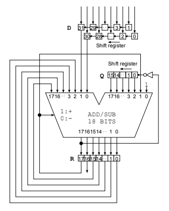
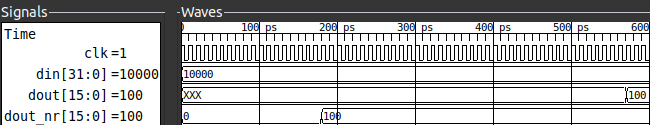
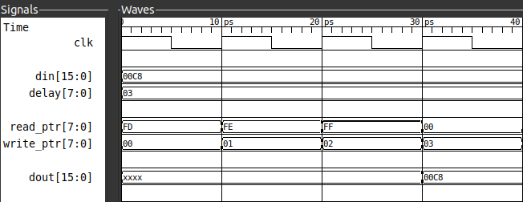
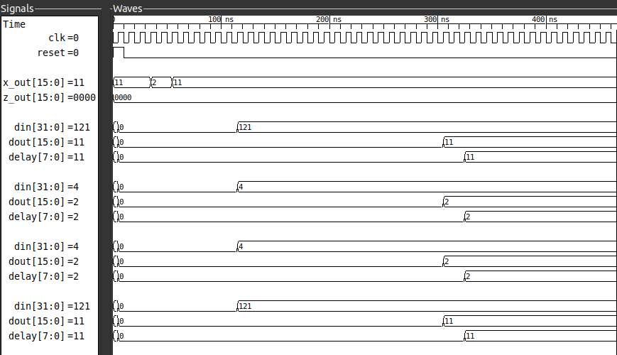
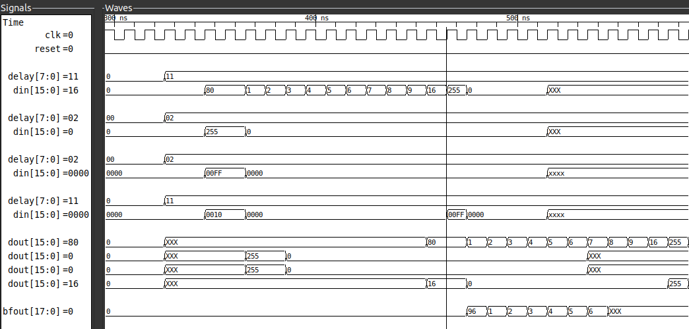
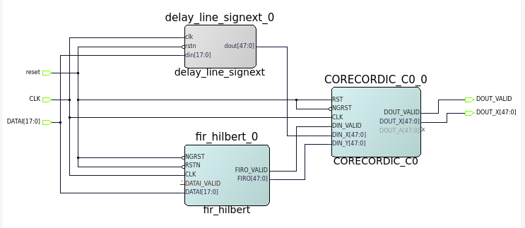
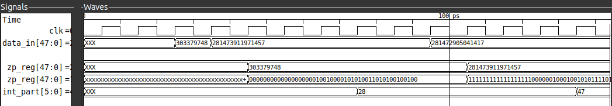
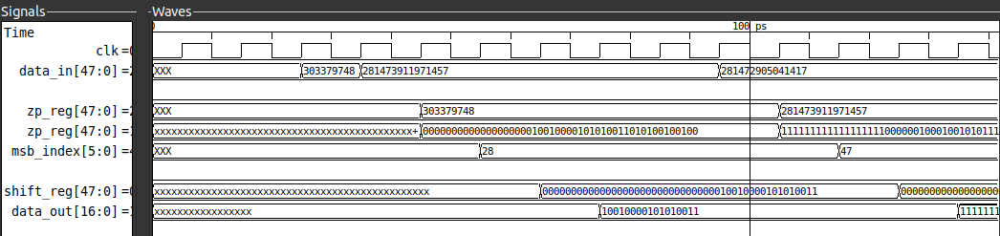

# Project Report : Echocore

## Table of Contents:
- [Project Objective](#project-objective)
- [What is an FPGA and why use it?](#what-is-an-fpga-and-why-use-it)
- [16-QAM digital communication](#16-qam-digital-communication)
    - [Brief Overview](#brief-overview)
    - [How it works](#how-qam-works)
    - [System Overview](#system-overview)
        - [Flowchart](#flowchart)
    - [Data input](#data-input)
    - [Symbol Mapping](#symbol-mapping)
- [Ultrasound Imaging](#ultrasound-imaging) 
    - [Brief Overview](#brief-overview-1)
    - [Why use ultrasounds](#why-use-ultrasounds)
    - [System Overview](#system-overview-1)
        - [Flowchart](#flowchart-1)
    - [Data input](#data-input-1)
    - [Beamforming](#beamforming)
        - [Newton-Rapheson Method](#newton-rapheson-method)
        - [Non-restoring algorithm](#non-restoring-method)
    - [Envelope Detection](#envelope-detection)
        - [Hilbert transform](#hilbert-transform)
    - [Log Compression](#log-compression)
        - [Calculation of the integral part](#calculation-of-the-integral-part)
        - [Calculation of the fractional part using CORDIC](#calculation-of-the-fractional-part)
    - [Scan Conversion](#scan-conversion)

## Project Objective
This project combines two advanced real-world FPGA applications on a single platform: B-mode ultrasound imaging and 16-QAM digital communication. It involves building Verilog modules for both applications and simulate/test them using Vivado/ISE and ModelSim. Ultrasound signal processing includes beamforming, quadrature demodulation, envelope detection, and log compression. 

For communication, a full 16-QAM system is developed using LUT-based modulators/demodulators and phase accumulators. Data output via UART/SPI will allow real-time streaming of ultrasound scans and QAM symbol recovery on a host PC using Python/MATLAB GUI. This integrated project emphasizes DSP techniques, FPGA toolchains, and real-time interfacing.

## What is an FPGA and why use it?
A Field-Programmable Gate Array (FPGA) is a type of integrated circuit that can be reconfigured or reprogrammed to implement a custom digital circuit. Unlike a microprocessor that executes software instructions sequentially, the hardware logic on an FPGA is hard-wired and executes in parallel. This allows for extremely high performance and low latency, making FPGAs ideal for tasks requiring real-time, high-throughput data processing.

The FPGA's architecture is perfectly suited for a project like EchoCore for three key reasons:

1. **Single-chip solution**: It allows for the integration of both a complex signal processing pipeline for wireless communication and an image processing pipeline for ultrasound onto a single chip, significantly reducing size, power consumption, and cost.

2. **Re-programmable and power-efficient**: Unlike Application-Specific Integrated Circuits (ASICs), FPGAs are flexible and can be reconfigured for different applications or algorithm updates. Their hardware-based parallelism is also far more power-efficient than software-based solutions for similar tasks.

3. **Enables parallel, real-time performance**: The most critical advantage for this project is the FPGA's ability to execute both the 16-QAM and Ultrasound pipelines in parallel, ensuring real-time performance for both data transfer and medical diagnostics.

## 16-QAM digital communication
### Brief overview

Quadrature Amplitude Modulation (QAM) is a modulation technique that encodes data by altering both the amplitude and phase of a carrier signal. This approach allows QAM to transmit more bits per symbol than modulation methods that only change one of these characteristics, such as Amplitude Shift Keying (ASK) or Phase Shift Keying (PSK).

### How QAM Works

QAM uses two carrier waves of the same frequency that are 90 degrees out of phase with each other. These are known as the in-phase (I) and quadrature (Q) components. Each data stream modulates the amplitude of one of these carrier waves, and the two modulated signals are then combined to create the final QAM signal. This composite signal's unique amplitude and phase combination represents a specific digital symbol.

The relationship between amplitude and phase for each symbol is visualized on a constellation diagram. Each point on this diagram, known as a constellation point, corresponds to a unique combination of amplitude and phase, which in turn represents a specific binary value. The number of points on the constellation diagram determines the number of bits each symbol can carry, and this is what defines the "order" of QAM (e.g., 16-QAM, 64-QAM, 256-QAM). For example, 16-QAM uses 16 points, allowing it to represent 4 bits per symbol (2^4=16).

### System Overview

#### Flowchart
The signal flow involved in the process is shown by the flowchart below

### Data Input
Currently, the input for the entire process is prepared by making use of a 4-bit linear-feedback shift register. A linear-feedback shift register (LFSR) is a shift-register where the input bit at each step is a function (usually XOR) of some of the previous bits. This makes LFSRs perfect for pseudorandom number generation in hardware.

The implementation of stage can be found [here](./qam16/verilog/transmission/four_pr.v)

### Symbol Mapping
The process of symbol mapping involves splitting the incoming 4-bit data into two 2-bit components (which serve as the in-phase and quadrature components respectively) and then mapping the resulting vector onto a constellation map. 

    <h4>For Example:</h4>
    <table style='text-align: center'>
        <tr>
            <th>In-phase</th>
            <th>Symbol Map</th>
            <th>Quadrature</th>
            <th>Symbol Map</th>
        </tr>
        <tr>
            <td>00</td>
            <td>-3</td>
            <td>00</td>
            <td>-3j</td>
        </tr>
        <tr>
            <td>01</td>
            <td>-1</td>
            <td>01</td>
            <td>-1j</td>
        </tr>
        <tr>
            <td>11</td>
            <td>3</td>
            <td>11</td>
            <td>3j</td>
        </tr>
        <tr>
            <td>10</td>
            <td>1</td>
            <td>10</td>
            <td>1j</td>
        </tr>
    </table>

**NOTE :** Since the quadrature components of the input data are 90deg out of phase from the inphase components, they are represented along with a 'j' in symbol mapping.

In QAM systems (like this one), symbol mapping is usually accomplished through the use of grey codes. The grey code is a binary numbering scheme where adjacent numbers differ only by a single bit. The use of gray codes resolves a major issue which lies with QAM systems: nearest-neighbour errors.
Nearest-neighbour errors occur when a received point slips to a neighbouring point on the constellation map due to external noise or distorsion. Since grey codes differ only by single bits the bit error rate (BER) is reduced significantly.

In verilog symbol mapping is achieved through the use of:
- Bit Slicing to split the 4-bit input data to two 2-bit components
- Case statements (multiplexers) to map the components onto a constellation map

The implementation of stage can be found [here](./qam16/verilog/transmission/symmap.v)

## Ultrasound Imaging
### Brief Overview
B-mode ultrasonography or brightness mode ultrasonography is a common imaging technique which involves the use of ultrasonic waves to display a 2-D grayscale image of internal organs.It works by the visualizing the strength of returning ultrasonic echoes (from internal organs) and mapping them to areas of differing brightness on a screen.

Brighter areas represent stronger echoes, often indicating dense tissues, while darker areas represent weaker echoes, often indicating fluid or soft tissues.

### Why use ultrasounds?
Here are some of the reasons for using ultrasounds over imaging and scanning techniques like X-rays, CT-scans and MRIs:
- **Safety:** Ultrasound imaging makes use of ultrasound waves rather than ionizing radiation (like in X-rays and CT scans) which makes it much safer to use frequently.
- **Portability and Accessibility:** Unlike MRIs and CT-scans (which require large-fixed machines), ultrasounds can be small and portable which makes them perfect for use in a project like Echocore.
- **Cost-effectiveness:** Ultrasounds are much cheaper compared to MRIs and CT-scans which lowers maintenance and infrastructure requirements.

### System Overview
#### Flowchart
The signal flow involved in the process of ultrasound process on an FPGA is as follows:

### Data Input
Ultrasound imaging systems typically use devices called transducers, which convert ultrasound waves into electrical signals. These transducers are usually arranged in an array, forming multiple channels. 
When ultrasound signals are reflected from tissues and return to the transducers, they are converted into digital values, typically represented in hexadecimal form. These values are stored in a file and can be read using Verilog's `readmemh` function. 

This is implemented using the module [here](./ultrasound/verilog/beamforming/readrf_vals.v)

### Beamforming
As ultrasound waves bounce off tissues within the body, the returning echoes arrive at the multiple transducer channels at slightly different times depending on the distance they travelled. In beamforming, carefully calculated delays are applied to the channels that receive their signals earlier, aligning them in time with the signals arriving later, so that all the echoes can be combined and processed as if they had been received simultaneously.

These delays can be calculated ahead of time as they only rely on the position of a particular transducer channel relative to other transducer channels. These delays are calculated using the formula:

$$ \text{t}=\sqrt{z^2 + (x_j-x)^2} $$

The positions of all transducer channels are also stored in hex files and are read using the module [here](./ultrasound/verilog/beamforming/coord_rom.v)

These values are then fed into delay calculation modules, which determine the required delay values using a square root module [here](./ultrasound/verilog/beamforming/sqrt_nr.v)

The Square root calculation is one of the more important parts of the entire pipeline since it is particularly difficult to implement in verilog; the choice of algorithm for the calculation of the square root thus becomes very important for the pipeline.

#### Newton-Rapheson method
The earlier iterations of the pipeline made use of the **Newton-Rapheson method** for calculating square roots.
The idea is to start with an initial guess at a root, approximate the function by its tangent line near the guess, and then take the root of the linear approximation as a next guess at the function's root. This will typically be closer to the function's root than the previous guess, and the method can be iterated. 

This can be easily understood by the formula:

$$ y_{next} = \frac{1}{2}\left( y_{curr} + \frac{N}{y_{curr}} \right) $$

where: $N$ = input number 
$y_{curr}$ = the current guess for sqrt(N) 
$y_{next}$ = the updated guess

This method remains popular among mathematicians today, as it provides an elegant algorithm for calculating square roots. However, it is not the most ideal choice for digital systems such as FPGAs, since it relies on division — an operation that is resource- and power-intensive in hardware. Additionally, the use of division introduces the risk of division by zero, meaning that any module implementing this algorithm must also include a safeguard against zero inputs.

#### Non-Restoring method
The recent iterations of the project switched to the non-restoring square root algorithm which is specifically designed for digital systems like FPGAs in mind. The algorithm works similar to long division but instead of dividing, it "builds" the square root bit by bit.

This is done by performing bit shifts and subtractions instead of using the division operator making the process a lot more efficient and quick when compared to the Newton-Rapheson method.

#### A comparison between the algorithms
The figure below compares different algorithms for calculating the square root of the decimal value 10,000. The Newton–Raphson method produces the correct result in 570 ps (57 cycles), while the Non-Restoring method achieves the result much faster, in 180 ps (18 cycles).

In the [delay control module](./ultrasound/verilog/beamforming/delay_con.v), multiple delay calculation modules are instantiated using generate blocks (one for each channel). After the delays are computed, these values are passed to the [sample delay module](./ultrasound/verilog/beamforming/sample_delay.v), which are also instantiated using generate blocks (again, one for each channel).

The sample delay module works like a FIFO delay line: it writes incoming samples into a buffer and reads them back after a programmable number of clock cycles, creating a flexible, per-channel time alignment unit.

Finally the [summation module](./ultrasound/verilog/beamforming/summ_sa.v) makes use of a serial accumulator to sum-up all the signals from the channels after the delay has been applied.

The figure below highlights the entire pipeline at play:

### Envelope Detection
When ultrasound waves are received by the transducer, the signals they produce are not smooth or directly interpretable; instead, they contain rapid oscillations at the carrier frequency.

Envelope detection is the process that extracts the outer “shape” or amplitude profile of these oscillating signals. By removing the high-frequency fluctuations and highlighting only the slowly varying amplitude information, envelope detection provides a clearer picture of the signal’s true strength over time. This step is crucial, because it transforms the raw radio-frequency data into a form that corresponds more closely to the variations in tissue structure, making the information suitable for further image processing and eventual visualization.

The signals formed after beamforming are oscillatory and not directly usable for image intensity. To overcome this, a quadrature component of the original signal is constructed which is then combined with the original signal to compute the magnitude. This results in a smooth envelope which corresponds to the actual echo strength from tissues.

The generation of the quadrature component is done by using a technique known as the Hilbert transform.

#### Hilbert Transform
The Hilbert Transform is a mathematical function which is used to shift the phase of a signal by 90deg. The Hilbert transform takes in a real valued function $x\left( t \right)$ and outputs a function which is phase shifted by 90deg, $\hat{x}\left( t \right)$.

Together they form the analytic signal:

$$ z\left( t \right) = x\left( t \right) + j\hat{x}\left( t \right) $$

The envelope is calculated by simply taking the magnitude of the signal:

$$ Envelope(t) = |z\left( t \right)| = \sqrt{x\left( t \right)^2 + \hat{x}\left( t \right)^2} $$

This project uses the Hilbert Transform IP core provided by Microchip to generate the quadrature component of the signal. An additional IP core ensures that the quadrature component is fully computed before both the in-phase and quadrature signals are passed to another IP core, which calculates the magnitude of the analytic signal.

### Log Compression
The ultrasound signals still contain a wide range of amplitudes after they've been beamformed and their envelopes detected. Some echoes like the ones coming from bones are really strong, while others like the ones coming from softer tissues deeper in the body.

To address this issue, log compression is applied to the ultrasound signals. This process takes the logarithm of the envelope-detected signal reducing the dynamic range of the ultrasound signals.

The process of Log compression begins with a FIFO buffer which is responsible for storing the incoming values from envelope detection until the pipeline ahead is done processing the current input.

#### Calculation of the integral part
The Log (base 2) calculation in verilog is accomplished using two modules, one responsible for calculating the integer part of the logarithm while the other responsible for the calculation of the fractional part in fixed point format.

The process to find the integer part of the logarithm is quite straight forward, it can be easily accomplished by finding the index of the most significant bit of the number. That is,

$$ \left\lfloor \log_{2}x \right\rfloor = n \Leftrightarrow 2^n < x < 2^{n+1} $$

The implementation of this can be found [here](./ultrasound/verilog/logc/int_calc.v)

#### Calculation of the fractional part

The calculation for the fractional part of the logarithm is however a different story; the world beyond the decimal has always posed a problem for digital systems for it introduces the dilemma of range and accuracy; it is impossible to gain one without losing the other. The most recent iterations of the pipeline have used a 16-bit fractional width for the log calculation. The accuracy provided by this is also good enough for ultrasound applications.

Before computing the fractional part of the logarithm, the input is normalized by right-shifting it so that its MSB aligns with the fixed-point input range of the CORDIC unit. The fractional part is then calculated using the CORDIC algorithm.

This method is highly efficient for hardware because it replaces complex multiplication and division with simple shifts and additions. The core of the algorithm is a series of conditional operations that converge to the correct fractional value over several clock cycles.

The implementation of this can be found [here](./ultrasound/verilog/logc/log_frac_calc.v)

#### The Core Idea
The algorithm leverages the following identity

$$ \log_2x = \log_2\left( \prod_{i=0}^{N-1} k_i \right) = \sum_{i=0}^{N-1}\log_2\left( k_i \right) $$

The CORDIC algorithm is an iterative process of conditional subtractions. For a set number of steps, the normalized input is compared against a series of constants of the form:

$$ 1 + 2^{-i} $$

    <table style='text-align: center'>
    <tr>
        <td>i</td>
        <td>1+2^(-i)</td>
        <td>i</td>
        <td>1+2^(-i)</td>
    </tr>
    <tr>
        <td>0</td>
        <td>18000</td>
        <td>8</td>
        <td>18080</td>
    </tr>
    <tr>
        <td>1</td>
        <td>1C000</td>
        <td>9</td>
        <td>18040</td>
    </tr>
    <tr>
        <td>2</td>
        <td>1A000</td>
        <td>10</td>
        <td>18020</td>
    </tr>
    <tr>
        <td>3</td>
        <td>19000</td>
        <td>11</td>
        <td>18010</td>
    </tr>
    <tr>
        <td>4</td>
        <td>18800</td>
        <td>12</td>
        <td>18008</td>
    </tr>
    <tr>
        <td>5</td>
        <td>18400</td>
        <td>13</td>
        <td>18004</td>
    </tr>
    <tr>
        <td>6</td>
        <td>18200</td>
        <td>14</td>
        <td>18002</td>
    </tr>
    <tr>
        <td>7</td>
        <td>18100</td>
        <td>15</td>
        <td>18001</td>
    </tr>
    </table>

If the input is greater than or equal to the constant, a shift-and-subtract operation is performed on the input, and a corresponding pre-calculated value is added to a running total. If the condition is false, nothing changes. This step-by-step process systematically reduces the input toward one while accumulating the fractional logarithm in the running total. The final accumulated total is the fractional part of the logarithm.

### Scan Conversion
In ultrasound imaging, data is naturally acquired in a **polar or sector format** because the transducer elements send and receive waves at different angles relative to the probe. This raw data does not directly match the rectangular grid used by standard image displays. As a result, even if the underlying signals contain useful information, the image would appear distorted or unintuitive if shown directly.

Scan conversion is the process of transforming this polar coordinate data into a **Cartesian (x, y)** grid suitable for display. It involves **interpolation**, where signal values that fall between display pixels are estimated, ensuring that the image appears smooth and continuous. By remapping the ultrasound echoes into a consistent spatial layout, scan conversion makes anatomical structures easier to interpret while **preserving spatial resolution** and minimizing distortion

If the raw beamformed data is represented in polar form as:

$$ \text{I}(r, \theta) $$

with r as depth and θ as the steering angle, scan conversion maps it to a Cartesian grid:

$$ \text{I}(x, y) = I\left(\sqrt{x^2 + y^2}, \text{ } arctan(\frac{y}{x}) \right) $$