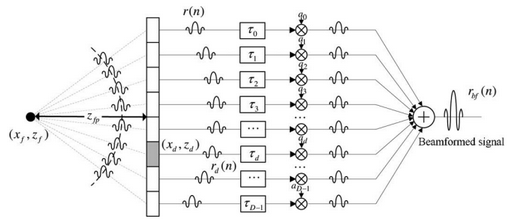
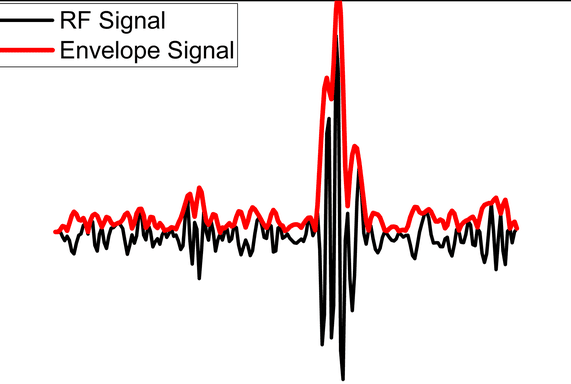

# Ultrasound Image Processing

## Table of Contents:
- [Introduction](#introduction)
    - [Brief Overview](#brief-overview)
    - [How it works](#how-it-works)
- [Ultrasound Image Processing system overview](#ultrasound-image-processing-system-overview)
    - [Flowchart](#flowchart)
    - [Data Input](#data-input)
    - [Beamforming](#beamforming)
    - [Envelope Detection](#envelope-detection)
    - [Log Compression](#log-compression)
    - [Scan Conversion](#scan-conversion)
- [Further Reading and Acknowledgements](#further-readings-and-acknowledgements)
 

## Introduction
### Brief Overview
Ultrasound imaging is a medical diagnostic technique that uses **high-frequency sound waves** to produce images of internal body structures in real time. Raw ultrasound signals (known as **radiofrequency (RF)** data) are collected by transducers and must undergo several stages of processing before a clinically useful image is formed.

### How It Works
The system begins by preparing the raw ultrasound signals so they can be consistently processed. This step ensures that variations in input strength or timing don’t distort the final results, providing a stable foundation for the next stages.

Once the signals are stabilized, the data is refined to emphasize the patterns that carry useful information. Subtle details in the echoes are preserved, while unwanted fluctuations and noise are reduced. This balance allows the system to maintain diagnostic accuracy without overwhelming the image with irrelevant artifacts.

In the final stage, the processed signals are transformed into values that map naturally into an image. The transformation improves the contrast between different tissue structures, making boundaries clearer and depth variations easier to interpret. This step also ensures that the resulting image can be efficiently displayed and analyzed in real time.

## Ultrasound Image Processing System Overview
### Flowchart
Here's a simple flowchart which depicts the general signal flow during the entire process: 

### Data Input
#### How are Ultrasound waves produced?
Ultrasound waves are produced by **transducers**. A transducer is a device which is responsible for converting one form of energy to the other. For ultrasound imaging, special crystals known as **piezoelectric crystals** are used inside the transducer.
When an **electric voltage** is applied to these crystals, they vibrate rapidly, producing **ultrasonic sound waves**.

The emitted ultrasonic waves propagate within the body and are partially reflected at **tissue interfaces**, returning to the transducer as **echoes**. These echoes are then interpreted as digital signals by analog to digital converters and are stored as hexadecimal values.

### Beamforming
As ultrasound waves bounce off tissues within the body, the returning echoes arrive at the multiple transducer channels at slightly different times depending on the distance they travelled. In beamforming, carefully **calculated delays** are applied to the channels that receive their signals earlier, aligning them in time with the signals arriving later, so that all the echoes can be **combined and processed** as if they had been received **simultaneously**.

#### So, why is beamforming important for the process?
Without beamforming, the signals received by different transducer elements would simply be added together as they arrive, which would **blur** the image since echoes from the same tissue point reach each element at slightly different times. Beamforming corrects this by introducing time delays so that all the echoes from the same location line up before being combined.

These delays can be calculated ahead of time as they only rely on the position of a particular transducer channel relative to other transducer channels. These delays are calculated using the formula:

$$ \text{t}=\sqrt{z^2 + (x_j-x)^2} $$

### Envelope Detection
When ultrasound waves are received by the transducer, the signals they produce are not smooth or directly interpretable; instead, they contain rapid oscillations at the carrier frequency.

Envelope detection is the process that extracts the outer “shape” or amplitude profile of these oscillating signals. By removing the high-frequency fluctuations and highlighting only the slowly varying amplitude information, envelope detection provides a clearer picture of the signal’s true strength over time. This step is crucial, because it transforms the raw radio-frequency data into a form that corresponds more closely to the variations in tissue structure, making the information suitable for further image processing and eventual visualization.

This is done through methods like the Hilbert Transform.

### Log Compression
The ultrasound signals still contain a wide range of amplitudes after they've been beamformed and their envelopes detected. Some echoes like the ones coming from bones are really strong, while others like the ones coming from softer tissues deeper in the body.

To address this issue, log compression is applied to the ultrasound signals. This process takes the logarithm of the envelope-detected signal reducing the dynamic range of the ultrasound signals.

#### Why is log compression important for the pipeline?
If displayed directly, this wide dynamic range would make it difficult to visualize subtle details, since the strong echoes would dominate the image while the weaker ones would barely be visible.

### Scan Conversion
In ultrasound imaging, data is naturally acquired in a polar or sector format because the transducer elements send and receive waves at different angles relative to the probe. This raw data does not directly match the rectangular grid used by standard image displays. As a result, even if the underlying signals contain useful information, the image would appear distorted or unintuitive if shown directly.

Scan conversion is the process of transforming this polar coordinate data into a Cartesian (x, y) grid suitable for display. It involves interpolation, where signal values that fall between display pixels are estimated, ensuring that the image appears smooth and continuous. By remapping the ultrasound echoes into a consistent spatial layout, scan conversion makes anatomical structures easier to interpret while preserving spatial resolution and minimizing distortion

If the raw beamformed data is represented in polar form as:

$$ \text{I}(r, \theta) $$

with r as depth and θ as the steering angle, scan conversion maps it to a Cartesian grid:

$$ \text{I}(x, y) = I\left(\sqrt{x^2 + y^2}, \text{ } arctan(\frac{y}{x}) \right) $$

## Further Readings and Acknowledgements
- [Implementing Ultrasound Image Processing on an FPGA](https://drive.google.com/file/d/1WhMdFHd_UWQ18-SOCPe8W1E1RZc37owy/view?usp=sharing)